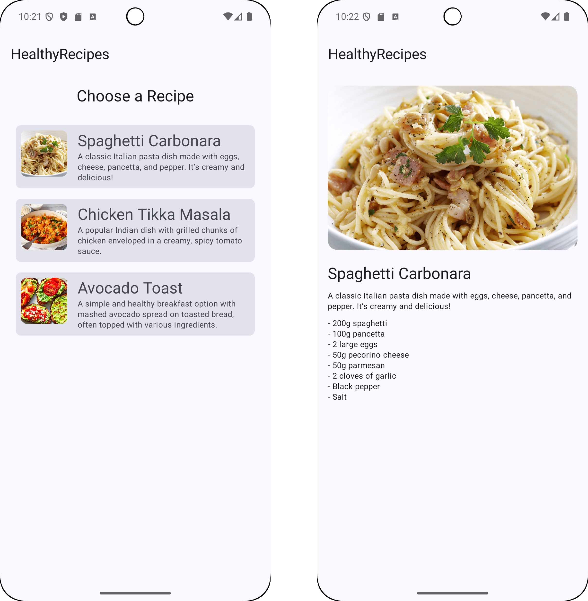
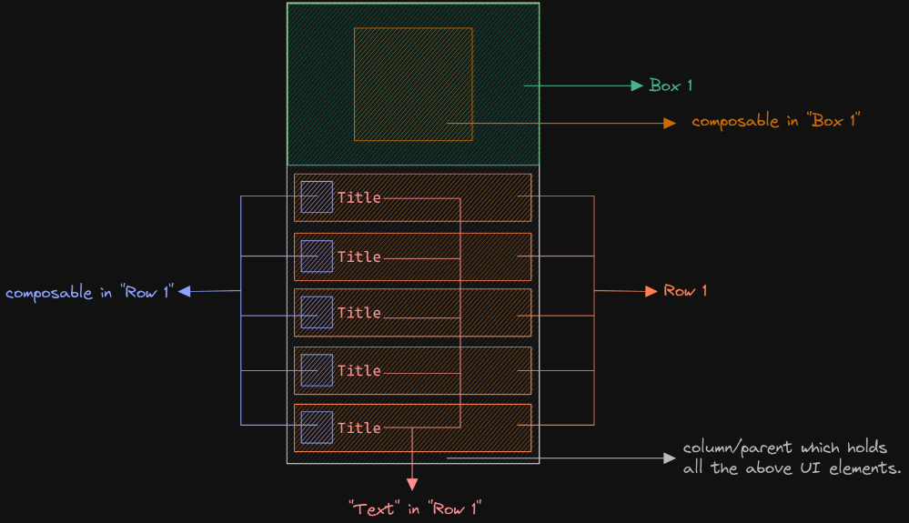
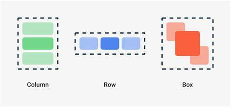
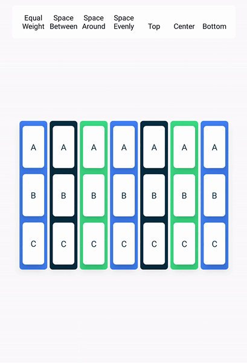
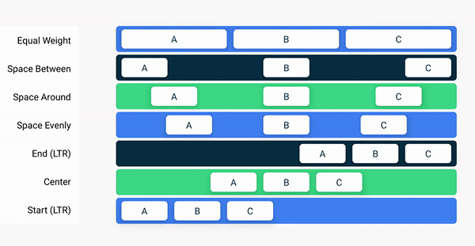
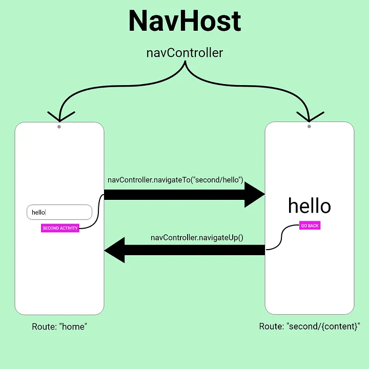

<!-- _footer: ""-->
  
# Android Studio User Interface

    Course Code: ELEE1146 

    Course Name: Mobile Applications for Engineers

    Credits: 15

    Module Leader: Seb Blair BEng(H) PGCAP MIET MIHEEM FHEA

---

## Designing an Android App

- Designing apps is like constructing a building
- **The Big Picture**
 - Follow these steps:
   - JetPack Composeable elements
   - Create an Activity (Kotlin class) for every screen
   - Code each Kotlin class with appropriate objects and actions
   - Test the application in the emulator

---

<div align=center>

## Designing an Android App

</div>



---

## Using the Android User Interface 

- The interface is a window on the screen of any mobile device
- Android apps run on various **form factors** such as smartphones, smart watches, tablets, televisions, etc. 
  Form factor refers to the screen size, configuration, or physical layout of a device
- The layout is designed with the Composable class

---
## Resources: String
- `strings.xml` is a default file that is part of every Android application and contains commonly used strings for an application. It is located in `res/values` folder
- Every string is composed of a **key**, also called the **id property**, which is the name of a control, and a **default value**, which is the text associated with the control


```xml
<resources>
    <string name='app_name'>Your apps name</string>
</resources>
```
---

<iv align=center>

## Compose Layouts

</div>




---

<div align=center>

## Columns 

</div>


 

---

<div align=center>

## Rows

</div>



---

## Units of Measurement 
The **text property** uses text from a string resource to display within the control. 

The **textSize property** can use various units of measurement, as shown below 
<div align=center>

|Unit of Measure | Abbreviation | Example |
|---|---|---|
|Inches| in| "0.5in"|
|Millimeters| mm| "20mm"|
|Pixels| px|"100px" |
|Density-independent pixels| dp or dip|"100dp" or "100dip"|
|Scaled-independent pixels| sp |"10sp"|

</div>


The preferred unit of measurement is often `sp`, which stands for scaled-independent pixels

---

## Adding a File to the Resources Folder

- Android creates a **Drawable** resource for any of these images when you save them in the `res/drawable` folder

<div align=center>

|Name|Description|
|---|---|
|drawable|Generic resources for any screen|
|mipmap - xxhdpi|Resources for extra, extra high-density screens|
|mipmap - xhdpi|Resources for extra high-density screens|
|mipmap - hdpi|Resources for high-density screens|
|mipmap - mdpi|Resources for extra, medium-density screens|
|mipmap - ldpi|Resources for low-density screens|
</div>

- Android projects have multiple drawable folders that are named after the resolution of the device

---

## Creating Activities

- An **Activity** is one of the core components of an Android application
- Each screen is considered an **activity**
  - The point at which the application makes contact with users
- Planning a program
  1. Gather and analyze the program requirements
  2. Design the user interface
  3. Design the program processing objects
  4. Code the program
  5. Test the program

---

## Creating Activities

- Adding a Class File
  - A **class** describes a group of objects and serves as a blueprint, or template, for creating those objects
  - An **object** is a specific, concrete instance of a class
  - When you create an object, you **instantiate** it; meaning you define one particular variation of the object

---

## The Android Manifest File

- The **Android Manifest** file contains:
  - the name of the Java application
  - a listing of each activity
  - permissions needed to access other Android functions (like accessing the Internet)
  - the minimum level of the Android APL
- Adding an Activity to the Android Manifest 
  - When applications have more than one activity, the Manifest must have an **intent** to navigate among multiple activities
  - An intent in Android is an abstract description of an operation to be performed

---

## The Android Manifest File


---

## Coding the Kotlin Activity

- A **method** is a set of Kotlin statements that can be included inside a Kotlin class to perform specific tasks
- The **method body** contains a collection of statements that define what the method does.
- Coding an `onCreate` Method
- Requires corresponding `setContent` Kotlin code to display a specific screen

```kt
override fun onCreate(savedInstanceState: Bundle?) {
        super.onCreate(savedInstanceState)
        setContent {
          ...
        }
    }
```

---

## Moving between composables

`NavController`: Handles the app's navigation and manages the back stack of composable screens.
`NavHost`: Hosts the navigation graph, specifying the composable destinations.

```kt
val navController = rememberNavController()
NavHost(
    navController = navController,
    startDestination = "home"
) {
    composable("home") { HomeScreen(navController) }
    composable("details") { DetailsScreen(navController) }
}

```



---

## @Composable and composable

<div style="font-size:27px">

- `@Composable`: This is an annotation used to mark a function as composable. It tells the compiler that this function can be used in the UI hierarchy to build the UI in a declarative way. Any function marked with @Composable can define part of the UI.

  ```kt
  @Composable
  fun MyScreen() {
      Text("Hello")
  }
  ```

- `composable()`: This is a function used within a NavHost to declare a navigation destination. It defines which composable function should be rendered when a user navigates to that destination.

  ```kt
  NavHost(navController, startDestination = "home") {
      composable("home") { HomeScreen() }
  }
  ```
<!--
@Composable defines UI components.
composable() defines navigation destinations
-->

</div>

---

## Resources

In Android Studio, resources (like `strings`, `layouts`, `drawables`, etc.) are referenced numerically because of how they are handled in the underlying Android system for efficiency and performance.

- **Efficiency/Performance**: The Android build system compiles all resources into a single class (R.java or R.kt) where each resource is assigned a unique integer identifier. Using integers for referencing resources allows for faster lookup during runtime compared to using text-based identifiers.

- **Naming Convention**: "File-based resource names must contain only lowercase a-z, 0-9, or underscore... must not start with a number" - source the Compiler

  ```kt
  avocado_toast_1.png // Acceptable
  1_Avocado-toast.png // Not Acceptable
  ```

---
## Now do the lab!

