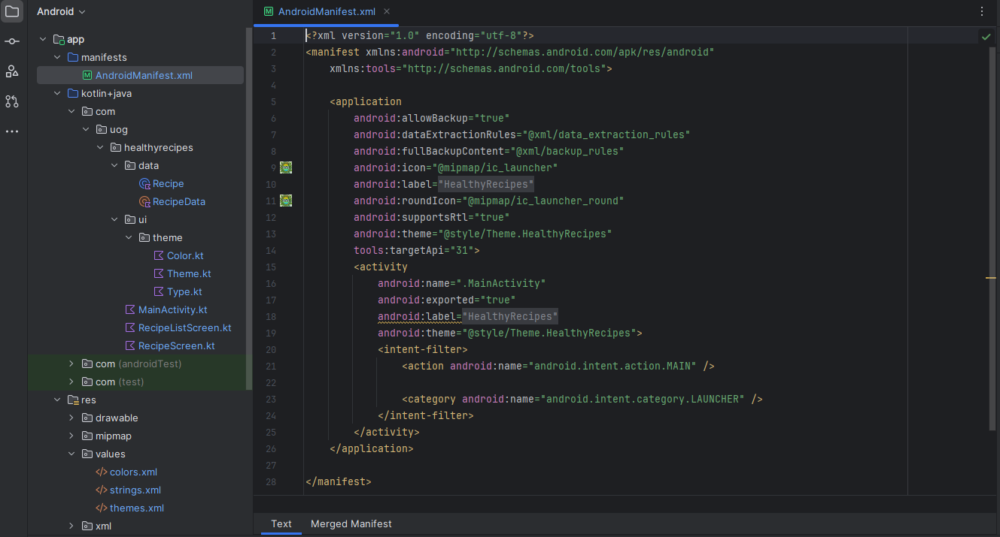

# Android Studio User Interface

    Course Code: ELEE1146 and COMP1836

    Course Name: Mobile Applications for Engineers/Technologists

    Credits: 15

    Module Leader: Seb Blair BEng(H) PGCAP MIET MIHEEM FHEA

---

## Designing an Android App

- Designing apps is like constructing a building
- **The Big Picture**
 - Follow these steps:
   - Create the user interface (XML layout) for every screen
   - Create an Activity (Java class) for every screen
   - Code each Java class with appropriate objects and actions
   - Test the application in the emulator

---

## Designing an Android App


---

## Using the Android User Interface 

- The interface is a window on the screen of any mobile device
- Android apps run on various **form factors** such as smartphone, smart watch, tablet, televisions, etc. 
  Form factor refers to the screen size, configuration or physical layout of a device
- The layout is designed with XML code Special Android-formatted XML code is extremely compact

---
## Resources: String
- `strings.xml` is a default file that is part of every Android application and contains commonly used strings for an application. It is located in `res/values` folder
- Every string is composed of a **key**, also called the **id property**, which is the name of a control, and a **default value**, which is the text associated with the control


```xml
<resources>
    <string name='app_name'>Your apps name</string>
</resources>
```
---

## Constraint Layout – the Default Layout 

- Allows you to create large and complex layouts with a flat view hierarchy (no nested view groups)
- Similar to **Relative Layout** in that all views are laid out according to relationship between sibling views and the parent layout
- It is more flexible then the Relative Layout and easier to use with Android Studio’s Layout Editor
- In this layout, you add at least one horizontal and one vertical constraint for each view
- Each constraint represents a connection or alignment to another view, the parent layout, or an invisible guideline

---
##  Constraint Layout


---

## Relative Layout

- A **Relative Layout** organizes layout components in relation to each other
- Provides more flexibility in 
positioning than Linear layouts
- Must be changed from the constraint 
default 


---

## Linear Layout

- A **Linear Layout** organizes layout components in a vertical column or horizontal row
- Objects are placed  directly below each other 
- Can be switched from vertical to horizontal orientation


---

## Units of Measurement 
The **text property** uses text from a string resource to display within the control. 

The **textSize property** can use various units of measurement, as shown below 
<div align=center>

|Unit of Measure | Abbreviation | Example |
|---|---|---|
|Inches| in| "0.5in"|
|Millimeters| mm| "20mm"|
|Pixels| px|"100px" |
|Density-independent pixels| dp or dip|"100dp" or "100dip"|
|Scaled-independent pixels| sp |"10sp"|

</div>


The preferred unit of measurement is often `sp`, which stands for scaled-independent pixels

---

## Adding a File to the Resources Folder

- Android creates a **Drawable** resource for any of these images when you save them in the `res/drawable` folder

<div align=center>

|Name|Description|
|---|---|
|drawable|Generic resources for any screen|
|mipmap - xxhdpi|Resources for extra, extra high-density screens|
|mipmap - xhdpi|Resources for extra high-density screens|
|mipmap - hdpi|Resources for high-density screens|
|mipmap - mdpi|Resources for extra, medium-density screens|
|mipmap - ldpi|Resources for low-density screens|
</div>

- Android projects have multiple drawable folders that are named after the resolution of the device

---

## Creating Activities

- An **Activity** is one of the core components of an Android application
- Each screen is considered an **activity**
  - The point at which the application makes contact with users
  - Constructed using XML layout files and a Java class
- Planning a program
  1. Gather and analyze the program requirements
  2. Design the user interface
  3. Design the program processing objects
  4. Code the program
  5. Test the program

---

## Creating Activities

- Adding a Class File
  - A **class** describes a group of objects and serves as a blueprint, or template, for creating those objects
  - An **object** is a specific, concrete instance of a class
  - When you create an object, you **instantiate** it; meaning you define one particular variation of the object

---

## The Andorid Manifest File

- The **Android Manifest** file contains:
  - the name of the Java application
  - a listing of each activity
  - permissions needed to access other Android functions (like accessing the Internet)
  - the minimum level of the Android APL
- Adding an Activity to the Android Manifest 
  - When applications have more than one activity, the Manifest must have an **intent** to navigate among multiple activities
  - An intent in Android is an abstract description of an operation to be preformed

---

## The Android Mainfest File



---

## Coding the Java /Kotlin Activity

- A **method** is a set of Java/Kotlin statements that can be included inside a Java/Kotlin class to perform specific tasks
- The **method body** contains a collection of statements that defines what the method does.
- Coding an `onCreate` Method
- Requires corresponding `setContentView` Java code to display a specific screen

```java
public void onCreate(Bundle savedInstanceState){
    super.onCreate(savedInstanceState);
    setContentView(R.layout.activity_main);
}
```

```kt
override fun onCreate(Bundle savedInstanceState : Bundle?){
    super.onCreate(savedInstanceState)
    setContentView(R.layout.activity_main)
}
```

---

## Java: Creating Button Event Handler

- An **event handler** is part of a program coded to respond to a specific event
- Tapping the button is called a click event
- Java code must contain the following sections
    - Class property to hold a reference to the Button object
`Button button = findViewbyId(R.id.button);`
  
- `button` object has methods from the class `Button` that are accessible
  - `onClickListener()` method to await the button click action
  - `onClick()` method to respond to the click event

---

## Creating Button Event Handler

```java
public class MainActivity extends ActionBarActivity {

    @overide
    public void onCreate(Bundle savedInstanceState){
        super.onCreate(savedInstanceState);
        setContentView(R.layout.activity_main);
        Button button = findViewById(R.id.btnRecipe);
        button.setOnClickListener(new View.onClickListener(){
            @Override
            public void onClick(View v){
             startActivity(new Intent(MainActivity.this, Recipe.class));   
            }
        });
}

```

---

## Kotlin: Creating Button Event Handler

- An **event handler** is part of a program coded to respond to a specific event
- Tapping the button is called a click event
- Java code must contain the following sections
    - Class property to hold a reference to the Button object
`button : Button = findViewbyId(R.id.button)`
  
- `button : Button = findViewbyId(R.id.button)`
  - `setOnClickListener{}` method to await the button click action
  - `setOnClick{}` method to respond to the click event


---

## Kotlin

```kt
class MainActivity : ActionBarActivity {
  override fun onCreate(Bundle savedInstanceState : Bundle?){
    super.onCreate(savedInstanceState)
    setContentView(R.layout.activity_main)
    
    button : Button = findViewById(R.id.btnRecipe)
    
    button.setOnClickListener{

      val intent = Intent(this, Recipe::class.java)
        
      // start your next activity
      startActivity(intent)
    }  
  }
}

```
---

## Now do the lab!

