<!-- _footer: "[Download as a PDF](https://github.com/UniOfGreenwich/ELEE1146-Lectures/raw/gh-pages/content/Exception_Error_Handling/Exception_Error_Handling.pdf)" -->
  
# Exception and Error Handiling

    Course Code: ELEE1146 

    Course Name: Mobile Applications for Engineers

    Credits: 15

    Module Leader: Seb Blair BEng(H) PGCAP MIET MIEEE MIHEEM FHEA

---

## Exceptions

>"Computer says, no!"

- compilation errors & run-time errors
- *exception* - error in the program that occurs 
   during its execution and disrupts the normal
   flow of instructions. 
- *exception* is a shorthand for an exceptional event. 
- Examples: 
  - division by zero
  - trying to access an out-of-bounds array elements
  - trying to open a file that does not exists, etc. 

--- 

## Exception Handling

- Enable programs to catch and handle errors

- Used in situations when the system could recover from the malfunction causing the exception

- Exception handling is a recovery (from an error in the program) procedure 

- *Exception handler* is the code that executes when an exception has been detected.

---

## Exceptions in Kotlin 

- An exception  is represented by an object

- Various predefined classes for different exceptions that can occur during execution time

- Exceptions are *thrown* by a program, and may be caught and handled by another part of the program

- A program can be separated into a normal execution flow and an *exception execution flow*

---

## Kotlin Exception Handling 

1. A method detects an error.
 
2. The method *throws an exception*.

3. The exception is *caught* and *handled* by an exception handler. 


---
## Exception Hierachy


---

## Kotlin Exception Handling Example (1)

```kt
fun main(args: Array<String>) {
    val number1: Int; val number2: Int; val result: Int
    val firstNumber: String; val secondNumber: String
    firstNumber = JOptionPane.showInputDialog("Enter first integer")
    secondNumber = JOptionPane.showInputDialog("Enter second integer")
    number1 = firstNumber.toInt()
    number2 = secondNumber.toInt()
    result = number1 / number2
    JOptionPane.showMessageDialog(null, "The result is $result", "Result", JOptionPane.PLAIN_MESSAGE)
    System.exit(0)
}
```
---

## Kotlin Exception Handling Example (2)

```kt
fun main() {
    val number1: Int; val number2: Int; val result: Int
    val firstNumber: String; val secondNumber: String
    firstNumber = JOptionPane.showInputDialog("Enter first integer")
    secondNumber = JOptionPane.showInputDialog("Enter second integer")
    try {
        number1 = firstNumber.toInt()
        number2 = secondNumber.toInt()
        result = number1 / number2
        JOptionPane.showMessageDialog(
            null, "The result is $result",
            "Result", JOptionPane.PLAIN_MESSAGE
        )
    } catch (nfe: NumberFormatException) {
        JOptionPane.showMessageDialog(
            null,
            "You must enter two integers!", "Invalid Number Format", JOptionPane.ERROR_MESSAGE
        )
    } catch (ae: ArithmeticException) {
        JOptionPane.showMessageDialog(
            null,
            "Second number should not be zero!", "Division by zero",
            JOptionPane.ERROR_MESSAGE
        )
    }
    System.exit(0)
}
```

--- 

## Kotlin Exception Handling 

- *try block* - encloses the code that may generate an exception

- *catch blocks* - specify the type of exception it can catch and contains an exception handler, which contain code to process an exception

- *finally block* - provides code that always executes regardless of whether or not an exception occurs

- *throws clause* - throws the exception and lets the code run, sometimes with unexpected consequences.

---





---

## Try/catch blocks

```kt
try  {
     // code that might generate exceptions
}
catch ( ex1 : Exception )  {
	// handle exceptions of type Exception1
}
catch ( ex2 : Exception )  {
	// handle exceptions of type Exception1
}
catch ( ex3 : Exception )  {
	// handle exceptions of type Exception1
}…
finally { /*Optional*/

}
```

---
## Example Exceptions

- `IOException` - thrown when: 
  - not sufficient disk space to create a file 
  - a read-only file is opened for writing
  - an not existent file is opened for reading

- `NumberFormatException`
  - entering a non-numeric value for a numeric variable

- `ArithmeticException`
    - division by zero

---

## Handling Exceptions in Kotlin with `runCatching`

In Kotlin, the `runCatching` function provides a concise way to handle exceptions without the need for explicit `try-catch` blocks.

- In Kotlin, `runCatching` is a convenient utility that encapsulates a code block and allows you to handle exceptions in a more functional style.

- It is used to capture exceptions that might occur during the execution of a block of code.

---

## `runCatching` Syntax

```kotlin
val result = runCatching {
    // Code that may throw exceptions
    // ...
}

result.onSuccess { value ->
    // Code to handle the successful execution
    println("Result: $value")
}

result.onFailure { exception ->
    // Code to handle the exception
    println("Exception: $exception")
}
```
---
## Rethrowing Exceptions

```kotlin
val result = runCatching {
    // Code that may throw exceptions
    // ...
}

result.onFailure { exception ->
    when (exception) {
        is NumberFormatException -> {
            // Handle NumberFormatException
        }
        // Handle other specific exceptions
        else -> {
            // Handle any other type of exception
        }
    }
}
```
---

## Example of Slide 16 as `runCatching`

```kotlin
val resultCatching = runCatching {
    // Set Input fields with prompt.
    firstNumber = JOptionPane.showInputDialog("Enter first integer")
    secondNumber = JOptionPane.showInputDialog("Enter second integer")
    number1 = firstNumber.toInt()
    number2 = secondNumber.toInt()
    result = number1 / number2

    JOptionPane.showMessageDialog(null, "The result is $result", "Result", JOptionPane.PLAIN_MESSAGE)
}

// Handling NumberFormatException
resultCatching.onFailure { e ->
    when (e) {
        is NumberFormatException -> {
            JOptionPane.showMessageDialog(null, "You must enter two integers!", "Invalid Number Format", JOptionPane.ERROR_MESSAGE)
        }
        is ArithmeticException -> {
            JOptionPane.showMessageDialog(
                null,"Second number should not be zero!", "Division by zero", JOptionPane.ERROR_MESSAGE)
        }
        else -> throw e // rethrow other exceptions
    }
}
```
---

## `runCatching` vs `try`, `catch` and, `finally`

- **Functional Approach:** `runCatching` allows a more functional programming style for error handling, separating the success path from the error handling.

- **No Explicit try-catch:** There is no need for an explicit try-catch block. Instead, exceptions are handled using the `onFailure` and `getOrElse` functions.

- **Separation of Concerns:** Error handling is separated into specific blocks (`onFailure` and `getOrElse`), improving code readability and maintainability.

- **No Direct Equivalent of `finally`:** In this specific context, there is no direct equivalent of the `finally` block. Code outside the `runCatching` scope is used for logic that needs to run regardless of success or failure.
