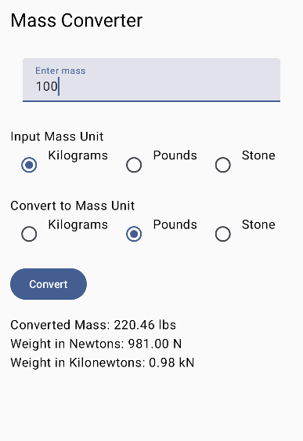
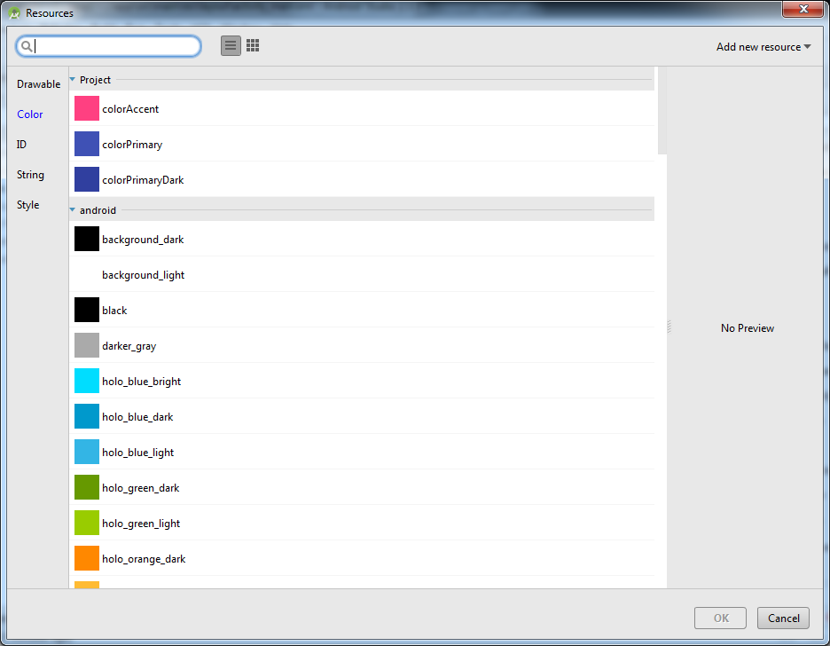
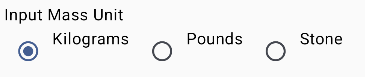
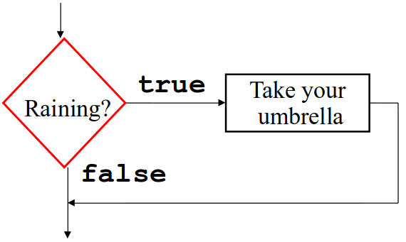
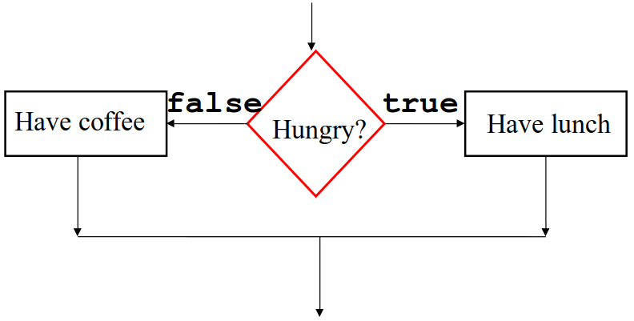

# Icons Decision Making Controls Pt1

    Course Code: ELEE1146 and COMP1836

    Course Name: Mobile Applications for Engineers/Technologists

    Credits: 15

    Module Leader: Seb Blair BEng(H) PGCAP MIET MIHEEM FHEA

---
<div align=center>

## The Medical Calculator App



</div>

---

## Launcher Icons

The Launcher Icon allows you to view which apps are available

- An icon is a graphic that takes up a small portion of screen space and provides a quick, intuitive representation of an app

- High-quality launcher icons can influence users to purchase your app

- Icons can establish brand identity 
- Icon dimensions are 48 X 48 pixels 
- The prefix ic_launcher is used to name launcher icons for Android apps. 


---

## Switch Components

[Documentation for switch\<controls\>](https://developer.android.com/develop/ui/compose/components/switch)

- Switch components allow users to select one option from a set.
  - Can be arranged horizontally or vertically (by default)
  - Has a label defined by the text property
  - Can be initially set to checked or unchecked
  - Only one `switch` in the group can be selected at a time
  - Good to offer a default selection (checked == `true`) for the option that is used most

---

## Changing the Text Color of Android Controls

- Use **hexadecimal color codes** to represent RGB (Red,Green,Blue)
  - [https://htmlcolorcodes.com/](https://htmlcolorcodes.com/)
- Codes range from `00` to `FF` (`00` none, `FF` none)
- Codes are indentified by a hashtag sign, followed by the RGB values
  - `#FF0000` is Red
  - `#00FF00` is Green
  - `#0000FF` is Blue
  - `FFFF00` is Yellow (Red + Green )
---

## Changing the Text Color of Android Controls
- You can also choos some basic colours from the Resources dialog
 

---

## Coding a `Switch` Control



```kt
 Text("Input Mass Unit")
Row {
    RadioButton(selected = inputMassUnit == "kg", onClick = { inputMassUnit = "kg" })
    Text("Kilograms")
    Spacer(modifier = Modifier.width(8.dp))
    RadioButton(selected = inputMassUnit == "lbs", onClick = { inputMassUnit = "lbs" })
    Text("Pounds")
    Spacer(modifier = Modifier.width(8.dp))
    RadioButton(selected = inputMassUnit == "stone", onClick = { inputMassUnit = "stone" })
    Text("Stone")
}
```
---
## Control Statements

- To branch the program execution - selection statements
  - `if, if/else`
  - `when`
- To repeat actions - loops
  - `while, do ... while, for`
- Boolean expressions to make decisions `true` and `false`
  - Using relational operators
  - Using boolean operators

---

## Relational Operators

<div align=center>

| Relational Operators | Meaning | Example | Resulting Condition |
|---|---|---|---|
|`==`| Equal to | `6 == 6` | True|
|`!=`| Not Equal to | `4 != 7` | True|
|`>`| Greater than | `3 > 2` | True|
|`<`| Less than | `8 < 1` | False|
|`>=`| Greater than or equal to | `5 >= 5` | True|
|`<=`| Less than or Equal to | `9 <= 6` | Flase|

</div>

---

## Logical Operators

<div align=center style="font-size: 24pt">

|Logical Operator | Meaning | Example|
|---|---|---|
|`&&`| And, all conditions must be true| `if(flight <  400 && hotel < 120)`|
|`\|\|`| Or, at least one conditions must be true| `if(stamp < 0.49 \|\| rate == 2)`|
|`!`| Not, reverse the meaning of the condition| `if(! (grade > 70))`|

</div>

---

## Truth Tables

<div align=center>

<table>
<tr>
<td>

|Operator| !Operator|
|---|---|
|value|value|
|`false`|`true`|
|`true`|`false`|

</td>
<td>

</td>
<td>

|Operand1| Operand2| Logocal AND (`&&`)|Logical OR (`\|\|`)|
|:---:|:---:|:---:|:---:|
|`false`|`false`|`false`|`false`|
|`false`|`true`|`false`|`true`|
|`true`|`false`|`false`|`true`|
|`true`|`true`|`true`|`true`|
</td>
</tr>
</table>

</div>

---

## Logical Operators Example

```kt
{
    val i1 : Int = 20
    val i2 : Int = 7
    val i3 : Int = 7
    var result: Boolean // default value is false

    result = !(i1 == i2)
    result = i1 != i2 // same as !(i1 == i2)

    result = i1 == i3
    result = i1 > i2 && i1 == i3
    result = i1 > i2 || i1 == i3
}
```
---
## Logical Operators Example 2

```kt
{
  val i1 : Int = 20
  val i2 : Int = 7
  val i3 : Int = 7
  var result: Boolean // default value is false
    
  result = !(i1 == i2); // true
  result = i1 != i2; // true

  result = i1 == i3; // false
  result = i1 > i2 && i1 == i3; // false
  result = i1 > i2 || i1 == i3; // true
}
```
---

## Flow of Control

- The order of statement execution in a program or method is called the **flow of control** 
- Unless specified otherwise, the order of statement execution is linear: one statement after the other in sequence
- Some programming statements modify that order, allowing us to:
  - decide whether to execute a particular statement, or
  - repeat a statement execution over and over
- These decisions are based on **conditions** in the program that evaluates to true or false

---

## Selection Statements

- A **selection statement** lets us choose which statement will be executed next
- Selection statements are sometimes called **conditional statements**
- Selection statements give us the power to make decisions and branch the program execution

- Single Selection 
  - the `if` statement 
- Double Selection 
  - the `if/else` statement 
- Multiple Selection 
  - the `when` statement 

---

## Single Selection Statement

- `if ( booleanExpr )` statement inside the brackets is the conditional check;
- Example:
  - It is raining outside. Take your umbrella.
Flowchart



---

## The `if` Statement: Examples

```kt
if ( countNumbers == 10 ) print( )

if ( grade >= 90 ) 
  print( “You are an excellent student!” )

if ( account <= creditLimit )
   print( “You have insufficient credit!” )

if ( dayOfTheWeek > 5 )
{
    print( “Time to relax…” )
    print( “Weekend.”)
}
```

---

## Double Selection Statement

- `if( booleanExpr ) statement1 else statement2`
- **Example**
  - If you are hungry - go for lunch, otherwise take a cup of coffee. 
- **Flowchart**


---
## The `if/else` Statement Examples

```kt
if ( dayOfTheWeek > 5 )
{
  print( “Weekend.”)
  print( “Time to relax…” )
}
else 
{
  print( “Workday.”)
  print( “Go to work!” )
}
```

---

## Statement Example

```kt
val grade : Char = ‘A’;

if ( grade == ‘A’) 
  print( “Excellent mark”)
else 
   if ( grade == ‘B’ ) 
     print( “Very good mark”)
   else
     if ( grade == ‘C’ )
       print( “Average mark”)
     else
       if ( grade == ‘D’ ) 
         print( “Below average mark”)
       else print(“Failing mark”)
```
---

## Multiple Selection Statment

```kt
when ( Expression ){
  case_value -> statement1
  case_value -> statement2
  …
  case_valueN -> statementN
  else -> { 
    statementD
  }
}

```

---
## The `when` Statement: Example

```kt
when (grade) {
    'A' -> print("Excellent mark")
    'B' -> print("Very good mark")
    'C' -> print("Average mark")
    'D' -> print("Below average mark")
    else -> {
        print("Failing mark")
    }
}

```

---

## Auto Increment and Decrement

- The increment and decrement operators are unary arithmetic operators with integer operand
- The auto increment operator (`++`) adds one to its operand
- The auto decrement operator (`--`) subtracts one from its operand
- The statement
			`var++;`
	is functionally equivalent to
			`var = var + 1;`

---
## Data Validation and Toast Notifications

- **Data Validation**
  - User entries must be checked for reasonable values
- **Toast Notification**
  - A toast notification communicates messages to the user (message slides upward into view like toast popping out of a toaster)

```kt
Toast toast = Toast.makeText(context, text, duration).show()
...
Toast.makeText(this@MainActivity, "Mass must be greater than 0", Toast.LENGTH_LONG).show()
```
---

## Using the `isChecked()` Method of `RadioButton` Controls

- `when` to determines if which `RadioButton` has been selected ...
  
```kt
val massInKg = when (inputUnit) {
            "kg" -> mass
            "lbs" -> mass / conversionToPounds
            "stone" -> mass / conversionToStones
            else -> 0.0
        }
```
<div style="font-size:24px">
<table>
<tr>
<td>

```kt
if (condition1) {
    // code
} else if (condition2) {
    // code
} else {
    // code
}
```

</td>
<td>

```kt
when {
    condition1 -> // code
    condition2 -> // code
    else -> // code
}
```
</td>

<td>

```java
switch (value) {
    case 1:
        // code
        break;
    case 2:
        // code
        break;
    default:
        // code
}

```

</td>
</tr>
</table>


---

## Coding the Button Event

```kt
Button(onClick = {
                val mass = massEntered.toDoubleOrNull()

                if (mass != null && mass > 0) {
                    convertedValues = convertor(numberFormat,mass, inputMassUnit, outputMassUnit)

                } else {
                    Toast.makeText(this@MainActivity, "Mass must be greater than 0",
                        Toast.LENGTH_LONG).show()
                }
            }) {
                Text("Convert")
            }
```
---

 ## `Map`

 - `Map` is a **collection** that contains pairs of objects (key, value)
- The first value of the pair is the key and the second is the value of the corresponding key.
- If multiple pair have same key then map will return the last pair value.
- The map entries is traversed in the specified order.
 - ```kt
   fun main(args : Array<String>)
   {
	    // declaring a map of integer to string
	    val map = mapOf(1 to "University", 2 to "of", 3 to "Greenwich")
		  // printing the map
		  println(map)
   }
   ```
   ```
   {1=University, 2=of, 3=Greenwich}
   ```
--- 

## `map`

```kt

fun main(args: Array<String>)
{
    //declaring a map of integer to string
    val map = mapOf(1 to "Proud", 2 to "to" , 3 to "be", 4 to "Gre")
    println("Map Entries : "+map)
    println("Map Keys: "+map.keys )
    println("Map Values: "+map.values )
}
```

<details>

<summary>Output</summary>

```
Map Entries : {1=Proud, 2=to, 3=be, 4=Gre}
Map Keys: [1, 2, 3, 4]
Map Values: [Proud, To, Be, Gre] 
```

</details>

--- 

## `map` and `repeat()`

```kt
val lyricalGenius = mapOf("Greeting" to "Hi, ", "Statement" to "my name is, ", "InterrogativeProNoun" to "what?",
      "InterrogativeProNoun2" to "Who?", "Alliteration" to "chka-chka,","Name" to "Slim Shady" )

  print(lyricalGenius["Greeting"])

  repeat(2) { i ->
      if (i == 0) print("${lyricalGenius["Statement"]}${lyricalGenius["InterrogativeProNoun"]}")
      else {
          // Print the greeting and statement values
          print(" ${lyricalGenius["Statement"].toString()
              .replaceFirstChar { if (it.isLowerCase()) it.titlecase(Locale.getDefault()) else it.toString() }}")
          // Print the interrogative pronoun value based on the iteration index
          print("${lyricalGenius[if (i % 2 == 0) "InterrogativeProNoun" else "InterrogativeProNoun2"]}")
      }
  }
  // Print the alliteration and name values
  print( "\n ${lyricalGenius["Statement"].toString().
    replaceFirstChar { if (it.isLowerCase()) it.titlecase(Locale.getDefault()) else it.toString() }}" +
          "${lyricalGenius["Alliteration"]} ${lyricalGenius["Name"]} \n")
```

<details>
<summary>Output</summary>

<div style="font-size:20px">

```
Hi, my name is, what? My name is, Who? 
My name is, chka-chka, Slim Shady
```

</div>

</details>
