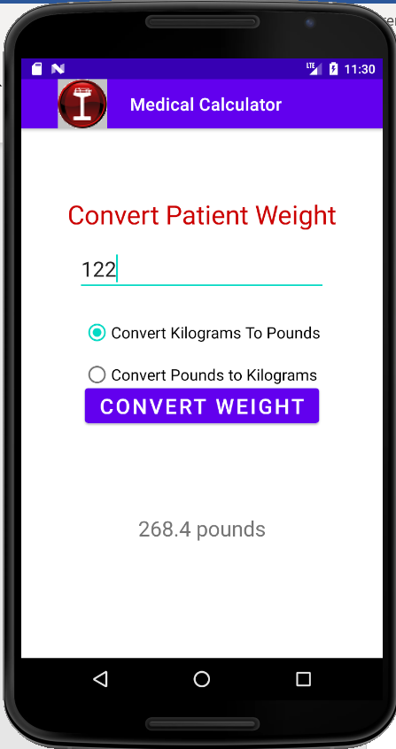
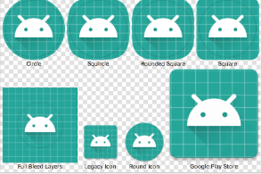

# Icons Decision Making Controls Pt1

    Course Code: ELEE1146 and COMP1836

    Course Name: Mobile Applications for Engineers/Technologists

    Credits: 15

    Module Leader: Seb Blair BEng(H) PGCAP MIET MIHEEM FHEA

---

## The Medical Calculator App

---

## Launcher Icons

The Launcher Icon allows you to view which apps are available

- An icon is a graphic that takes up a small portion of screen space and provides a quick, intuitive representation of an app

- High-quality launcher icons can influence users to purchase your app

- Icons can establish brand identity 
- Icon dimensions are 48 X 48 pixels 
- The prefix ic_launcher is used to name launcher icons for Android apps. 

---

## Radio Buttons and RadioGroups Controls

[Documentation for Radio\<controls\>](https://developer.android.com/reference/android/widget/RadioGroup?hl=en)

A `RadioButton` control selects or deselects an option
- Can be arranged horizontally or vertically (by default)
- Has a label defined by the text property
- Can be initially set to checked or unchecked
- Typically used together in a `RadioGroup`
- Only one `RadioButton` in the group can be selected at a time
- Good to offer a default selection (checked == `true`) for the option that is used most

---

##

---

##

---

