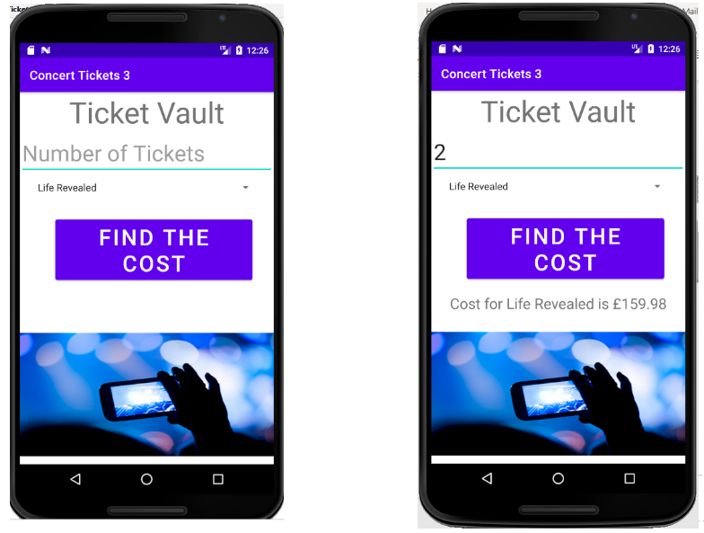
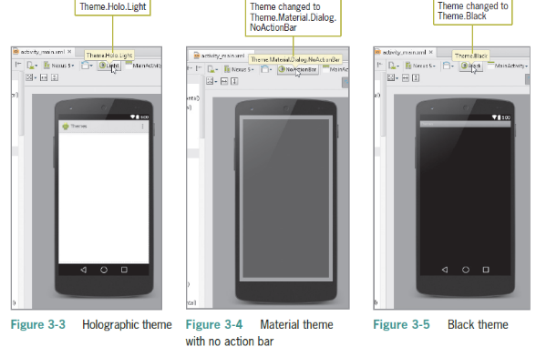
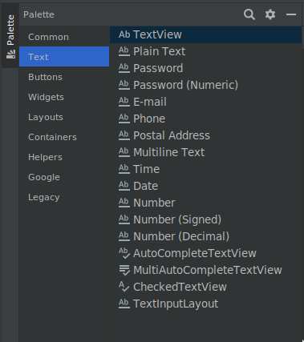

# Input Variables Operations Pt1

    Course Code: ELEE1146 and COMP1836

    Course Name: Mobile Applications for Engineers/Technologists

    Credits: 15

    Module Leader: Seb Blair BEng(H) PGCAP MIET MIHEEM FHEA

---

## The result of the lab


---

## Android Themes

- A **theme** is a style applied to an Activity or an entire application
    - Themes are Android’s mechanism for applying a consistent style to an app or Activity
    - The style specifies the visual properties of the elements that make up a user interface, such as colour, height, padding, and font size
    - Some themes change the background wallpaper of the Activity, while others hide the title bar or display an action bar
    - Some themes display a background depending on the size of the mobile device
  - You can preview themes in the emulator in activity_main.xml
  - By changing the theme in the emulator in activity_main.xml file, you can preview what the theme looks like, but to change it permanently in the application, you must define the themes in the themes.xml file within the values subfolder of the Activity
---

## Android Themes


 - The default for Nexus 6 shows the title bar displaying the app name with a white background when running the app

- More on change of app theme on:
  - https://developer.android.com/codelabs/basic-android-kotlin-training-change-app-theme#0

---

## Previewing a Theme

- Check the `activity_main.xml` file in the emulator to see what your screen looks like:



---

## Simplifying User Input

- Users can enter text in multiple ways on Android phone:
    - Through an onscreen soft keyboard
    - An attached flip button hard keyboard
    - Voice-to-text capabilities on most phone models
  
- The onscreen keyboard is called a soft keyboard
   - Input can be in the form of tapping or gestures (using two fingers to pan, rotate, or zoom)
   - Primary design challenge is to simplify user experiences
   - Use legible fonts, simplify input, and optimize each device’s capabilities to maximize user experience

---

## Simplifying User Input


- Text Fields are the most common type of mobile 
    - input
    - Can be free-form plain text
    - Numbers
    - A person’s name, 
    - password, email, 
    - phone number
    - A date and time
    - Multiline text



---

## Simplifying User Input

- The Concert Tickets app requests the number of concert tickets which is a positive integer number
- There is a variety of Text Fields to choose from in Android Studio 
- By selecting the Number text field, users can enter only positive integers from the keyboard
- This way, the app will not accept letters or symbols from the keyboard, saving developers time for writing data validation code 

---

## Adding a String Array

- In order to define a drop-down list in Android Studio, you will need to define a string-array in `strings.xml`
 - A string array defines a string resource of related items in a central location within `strings.xml`
 - An item defines an individual entry within a string array
    -  As you type the string-array XML code, the Android Studio editor offers suggestions in a panel that can complete the statement

---

## String-Array

```xml
<resources>
    <string name="app_name">Concert Tickets</string>

    <string name="txtTickets">Number of Tickets</string> 
    <string name="prompt">Select Group</string>
    <string name="description">Concert Image</string>
    <string name="btnCost">FIND THE COST</string>

    <string-array name="txtGroup">
        <item>Linkin Park</item>
        <item>Hollywood Undead</item>
        <item>Man with a Mission</item>
    </string-array>

</resources>
```

---

## Setting the Hint Property for a Text Field
- A hint is a short description of a field visible as light-colored 
text (called a watermark)
- When the user clicks the control, the hint is removed, and the user is free to type the requested input


---

## Using the Android Spinner Control

- A **Spinner control** is a widget like a drop-down list for selecting a single item from a fixed list
- The spinner control displays a list of strings called **items** in a pop-up window
- A **prompt**, which can be used to display instructions at the top of the Spinner control, also is stored in strings.xml and is named prompt
- The Spinner property called **entries** connects the String Array to the Spinner control for display in the application
- The prompt property of the Spinner connects to the resource named @string/prompt`
- The entries property of the Spinner connects to the resources of the string array `@array/txtGroup`
- The actual groups are displayed in the Spinner when the app is executed in the emulator
---

## Coding the widget Classes

- A **variable** is used in programming to contain data that changes during the execution of a program
**Final** variables can be initialized but cannot be changed
**EditText** code assigns input value to variable named **tickets**

```java
final EditText tickets = findViewById(R.id.editTextNumber);
```
The Spinner assigns the value from the user’s input to the variable named group

```java
final Spinner group = findViewById(R.id.spinner);
```
---

## Variables

- Variables stores values
- Each variable has 
  - an identifier (name) 
  - a type (data type)
    - variable size 
    - range of values
    - the operations that can be performed with this variable type

---

## Primitive Data Types


---

## What about Strings

```java
String groupChoice;
```

- String Data Type
  - The String type is a class and not  a primitive data type
  - A string can be a character, word, or phrase

- Declaring the Variables
  - Typically declared at the beginning of an Activity
  - Variables must be declared before you can use them

```java
double costPertTicket = 79.99
int numberOfTickets;
double totalCost;
```

---

## Full code

```java
public class MainActivity extends AppCompatActivity {
    
    double costPerTicket = 79.99;
    int numberOfTickets;
    double totalCost;
    String groupChoice;

    @Override
    protected void onCreate(Bundle savedInstanceState){
        super.onCreate(savedInstanceState);
        setContentView(R.layout.activity_main);
        final EditText tickets = findViewById(R.id.editTextNumber);
        final Spinner group = findViewById(R.id.spinner);
        final Button cost = findViewById(R.id.button);
        
        cost.setOnClickListener(new View.OnClickListener() {
            final TextView result = findViewById(R.id.txtResult);
            @Override
            public void onClick(View v){
                numberOfTickets = Integer.parseInt(tickets.getText().toString());
                totalCost = costPerTicket * numberOfTickets;
                groupChice = group.getSelectedItem( ).toString( );
                result.setText("Cost for " + groupChoice + " is £" + currency.format(totalCost));
            }
        });
    }
}
```
---

## `getText()` Method

- Read data stored in the EditText control with the `getText()` method
- Data is read in as a string, by default
- A `Parse` class is used to convert strings into numbers


<div align=center>

|Numerical Data Type| Parse Types|
|---|---|
|Integer| `Integer.parseInt()`|
|Float| `Float.parseFloat()`|
|Double| `Double.parseDouble()`|
|Long| `Long.parseLong()`|

</div>

---

## `getText()` Method

- The `getText()` method extracts the text from EditText tickets and converts it to String 
- The `parseInt()` method converts a string to integer

```java
numberOfTickets = Integer.parseInt(tickets.getText().toString());
```

---

## Working with Mathematical Operations

<div align=center>

| Arithmetic Operator | Use |Assignment Statement|
|----|---|---|
| + | Addition | `value = itemPrice + itemTax;`|
| - | Subrtaction | `score = previousScore - 2;`|
| * | Multiplication | `totalCost = costPerTicket * numberOfTickets;`|
| / | Division | `average = totalGrade / 5.0;`|
| % | Remainder | `leftOver = widgetAmount % 3;`|
| ++ | Increment (adds 1) | `score++`|
| -- | Decrement (subtracts 1 | `score--`|
</div>

---

## Displaying Android Output

- **`getSelectedItem()` Method**
  - The `getSelectedItem()` method returns the text label of the currently selected Spinner item.

```java
groupChoice = group.getSelectedItem().toString();
```


-**`setText()` Method**
  - The `setText()` method displays text in a TextView control

```java
result.setText("Cost for "+ groupChoice + " is " + totalCost);
```