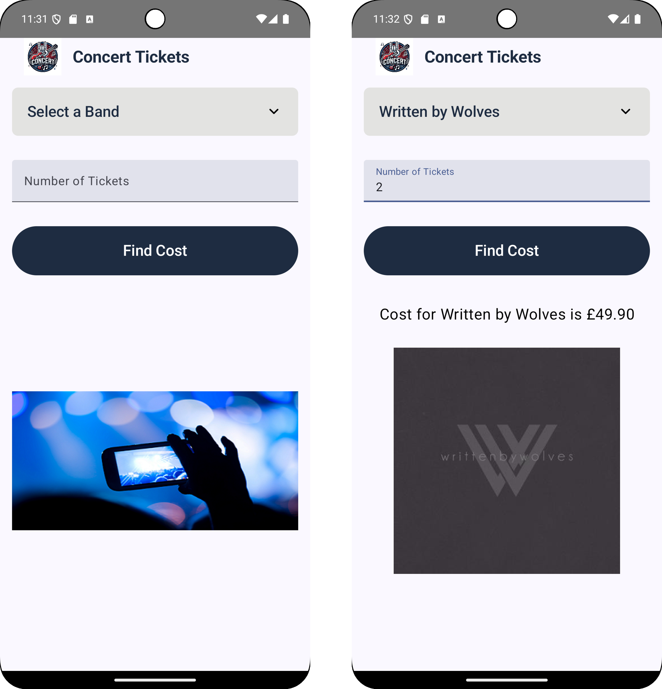
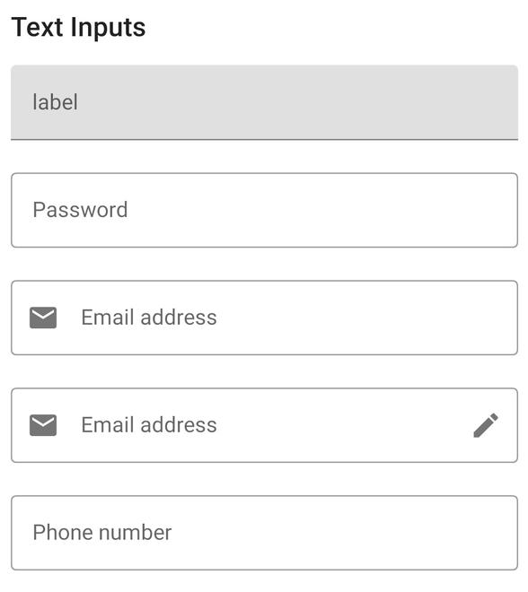
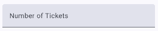
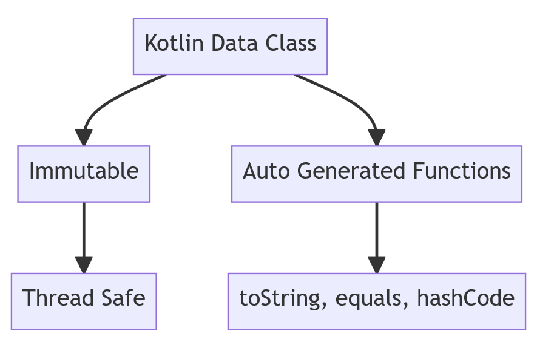
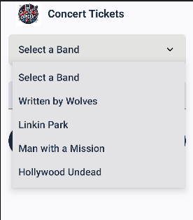

# Input Variables Operations Pt1

    Course Code: ELEE1146 

    Course Name: Mobile Applications for Engineers

    Credits: 15

    Module Leader: Seb Blair BEng(H) PGCAP MIET MIHEEM FHEA

---

## The result of the lab



---

## Android Themes

- A **theme** is a style applied to an Activity or an entire application
    - Themes are Android’s mechanism for applying a consistent style to an app or Activity
    - The style specifies the visual properties of the elements that make up a user interface, such as colour, height, padding, and font size
    - Some themes change the background wallpaper of the Activity, while others hide the title bar or display an action bar
    - Some themes display a background depending on the size of the mobile device
  - You can preview themes in the emulator in `activity_main.xml`
  - By changing the theme in the emulator in `activity_main.xml` file, you can preview what the theme looks like, but to change it permanently in the application, you must define the themes in the `themes.xml` file within the values subfolder of the Activity

---

## Simplifying User Input

- Users can enter text in multiple ways on Android phone:
    - Through an onscreen soft keyboard
    - An attached flip button hard keyboard
    - Voice-to-text capabilities on most phone models
  
- The onscreen keyboard is called a soft keyboard
   - Input can be in the form of tapping or gestures (using two fingers to pan, rotate, or zoom)
   - Primary design challenge is to simplify user experiences
   - Use legible fonts, simplify input, and optimize each device’s capabilities to maximize user experience

---

## Simplifying User Input


- `TextFields` are the most common type of mobile 
    - input
    - Can be free-form plain text
    - Numbers (whole/decimals)
    - A person’s name, 
    - password, email, 
    - phone number
    - A date and time
    - Multiline text



---

## Simplifying User Input

- The Concert Tickets app requests the number of concert tickets, which is a positive integer number.
- There is a variety of `TextFields` to choose from in Jetpack Compose.
- By selecting the `TextField` with specific `keyboardOptions`, developers can customize the keyboard for different input types. For instance, by using the `Number` keyboard type, users can only enter numbers, preventing the app from accepting letters or symbols.
- This way, the app will not accept invalid input, saving developers time from having to write extra validation code.


---

## Example `TextField`

```kt
TextField(
      value = ticketCount,
      onValueChange = onTicketCountChange,
      label = { Text("Number of Tickets") },
      keyboardOptions = KeyboardOptions(keyboardType = KeyboardType.Number),
      modifier = Modifier.fillMaxWidth()
)
```



API here: [user-inputs](https://developer.android.com/develop/ui/compose/text/user-input#:~:text=TextField%20allows%20users%20to%20enter%20and%20modify%20text.%20This%20page)

---

## Adding a String Array

- In order to define a drop-down list in Android Studio, you will need to define a string-array in `strings.xml`
 - A string array defines a string resource of related items in a central location within `strings.xml`
 - An item defines an individual entry within a string array
    -  As you type the string-array XML code, the Android Studio editor offers suggestions in a panel that can complete the statement

---

## String-Array

```xml
<resources>
    <string name="app_name">Concert Tickets</string>

    <string name="txtTickets">Number of Tickets</string> 
    <string name="prompt">Select Group</string>
    <string name="description">Concert Image</string>
    <string name="btnCost">FIND THE COST</string>

    <string-array name="txtGroup">
        <item>Linkin Park</item>
        <item>Hollywood Undead</item>
        <item>Man with a Mission</item>
        <item>Written by Wolves</item>
    </string-array>
</resources>
```

---

## Data Class

```kt
data class Band(
  val name: String, 
  val imageRes: Int,
  val price: Float)
```



---
## `Object` of `data` class

```kt
data class Band(
  val name: String, 
  val imageRes: Int,
  val price: Float)
```

```kt
object BandDataSource {
    val bands = listOf(
        Band("Select a Band", R.mipmap.concert, 0.0f),
        Band("Written by Wolves", R.mipmap.written_by_wolves,24.95f),
        Band("Linkin Park", R.mipmap.linkin_park, 63.95f),
        Band("Man with a Mission", R.mipmap.man_with_a_mission, 36.00f),
        Band("Hollywood Undead", R.mipmap.hollywood_undead,125.0f)
    )
}
```

```kt
var selectedBand by remember { mutableStateOf(BandDataSource.bands[0]) }
```

---

## Using the DropDownMenu

- A `DropDownMenu` is a widget used for selecting a single item from a fixed list of options.
- The `DropDownMenu` displays a list of `DropDownMenuItems` for users to choose from in a dropdown pop-up menu.
- A `label` or `hint` can be provided to display instructions or a title for the `DropDownMenu`, typically defined in your layout or resource files.
- The `DropDownMenuItems` represent the individual options within the menu and are usually connected to a data source, such as a `String` array or `listOf` `objects`, for display in the application.

---

## Coding the `DropDownMenu`



```kt
DropdownMenu(
        expanded = expanded,
        onDismissRequest = { expanded = false },
        modifier = Modifier
            .background(Color(0XFFE3E3E6))
            .width(350.dp)
    ) {
        BandDataSource.bands.forEach { band ->
            DropdownMenuItem(
                text = {
                    Text(
                        text = band.name,
                        color = Color(0Xff1e2c41),
                        fontSize = 20.sp)
                        },
                onClick = {
                onBandSelected(band)
                expanded = false
            })
        }
    }
```

---


## Variables

- Variables stores values
- Each variable has 
  - an identifier (name) 
  - a type (data type)
    - variable size 
    - range of values
    - the operations that can be performed with this variable type

---

## Primitive Data Types

|Type| Size | Signed | Unsigned|
|----|----|----|----|
| `Byte`   | $2^8$    | -127 to 128                | 0 to 255 |
| `Short`  | $2^{16}$ | -32,768 to 32,767            | 0 to 65,535|
| `Int`    | $2^{32}$ | -2,147,483,648 to 2,147,483,647 | 0 to 4,294,967,295| 
| `Long`   | $2^{64}$ | -9,223,372,036,854,775,808 to 9,223,372,036,854,775,807  | 0 to 18,446,744,073,709,551,615| 
| `Float`  | $2^{32}$ | -2,147,483,648 to 2,147,483,647  | 0 to 4,294,967,295| 
| `Double` | $2^{64}$ | -9,223,372,036,854,775,808 to 9,223,372,036,854,775,807  | 0 to 18,446,744,073,709,551,615|

> $2^{128}$ IPv6 340 undecillion

---

## Prespective: $2^{128}$ || 340 Undecillion using Encryption

AES-128 uses a 128-bit key, which means there are $2^{128}$ (approximately $3.4 \cdot 10^{38}$) possible keys. It would take to try all of them at a trillion combinations per second:

<div style="font-size:24px">

$$
\begin{equation*}
 Time (in seconds) = \frac{Number of Possible Keys}{Combinations per Second} = \frac{2^{128}}{1,000,000,000,000} 
\end{equation*}
$$

</div>

Let's calculate this:

<div style="font-size:24px">

$$
\begin{equation*}
\frac{2^{128}}{1,000,000,000,000} \approx 3.4 \cdot 10^{38} \text{ seconds}
\end{equation*}
$$

</div>

To convert this to years, you can use the fact that there are 31,536,000 seconds in a year:

<div style="font-size:24px">

$$
\begin{equation*}
\frac{3.4 \times 10^{38}}{31,536,000} \approx 1.08 \cdot 10^{30} \text{ years}
\end{equation*}
$$

</div>


<!--
-  AES-128 is considered a strong encryption algorithm, and it's designed to resist brute force attacks. Brute force attacks involve trying every possible combination of keys until the correct one is found.

- So, it would take approximately \(1.08 \times 10^{30}\) years to crack AES-128 encryption at a rate of a trillion combinations per second. This is an astronomically long period of time, far exceeding the age of the universe, making AES-128 a very secure encryption standard against brute force attacks with today's technology.
-->
---
## What about Strings

```kt
private var groupChoice: String? = null
```

- String Data Type
  - The String type is a class and not a primitive data type
  - A string can be a character, word, or phrase
  - `?` this is a Nullable type, meaning it can be either a `String` or `null`


---

## Elivs operator `?:`

<div style="font-size:24px">

```kt 
val count = ticketCount.toIntOrNull() ?: 0
```

- Data is read in as a `String`, by default, hence `toIntOrNull() ?` 
  - Parses the `String` as an `Int` number and returns the result or `null` if the string is not a valid representation of a number.
  - or by adding `?: 0` returns zero if `null`


```kt
Button(
        onClick = {
            val count = ticketCount.toIntOrNull() ?: 0
            if (selectedBand.name == "Select a Band") {
                onCalculate("Please select a band")
            } else if (count <= 0) {
                onCalculate("Enter value greater than 0")
            } else {
                val total = costPerTicket * count
                onCalculate("Cost for ${selectedBand.name} is ${format.format(total)}")
            }
        },
```

</div>

---

## Working with Mathematical Operations

<div align=center>

| Arithmetic Operator | Use |Assignment Statement|
|----|---|---|
| + | Addition | `value = itemPrice + itemTax;`|
| - | Subrtaction | `score = previousScore - 2;`|
| * | Multiplication | `totalCost = costPerTicket * numberOfTickets;`|
| ** | Power | `squared = 10**2`
| / | Division | `average = totalGrade / 5.0;`|
| % | Remainder | `leftOver = widgetAmount % 3;`|
| ++ | Increment (adds 1) | `score++`|
| -- | Decrement (subtracts 1) | `score--`|

</div>


---
<div style="font-size:23px">

## `NumberFormat` and `setText()`

<div style="font-size:23px">

- `NumberFormat`
  ```kt
  fun CalculateCostButton(selectedBand: Band, ticketCount: String, onCalculate: (String) -> Unit) {
    val format: NumberFormat = NumberFormat.getCurrencyInstance().apply {
        currency = Currency.getInstance("GBP"), maximumFractionDigits = 2, minimumFractionDigits = 2
    }
    ...
  }
  ```

- **Setting the `TextField`**

  ```kt
  CalculateCostButton(selectedBand, ticketCount) { totalCost = it }
  ...
  CostDisplay(totalCost)
  ...
  @Composable
  fun CostDisplay(totalCost: String) {
      Text(
          text = totalCost, fontSize = 20.sp, color = Color.Black,
          modifier = Modifier.fillMaxWidth(), textAlign = TextAlign.Center
      )
  }
  ```

  </div>