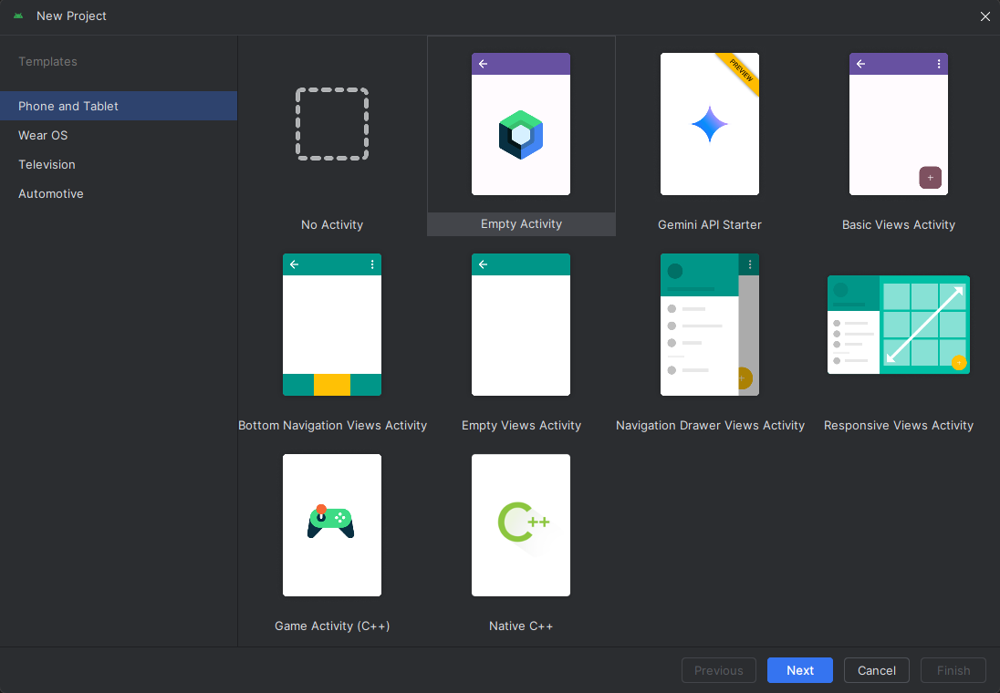
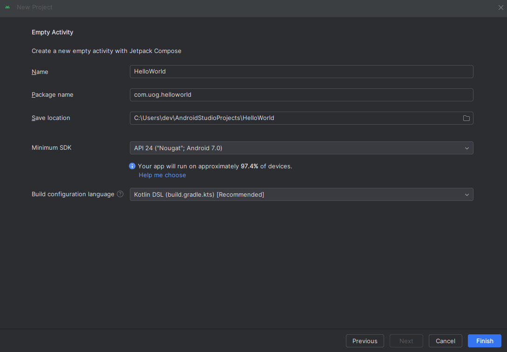
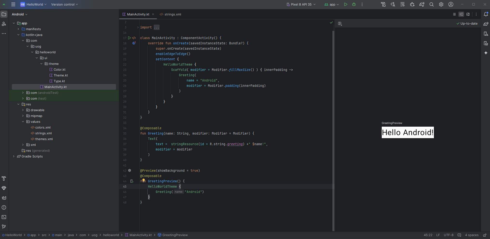

# Introduction to Android Studio

    Course Code: ELEE1146 and COMP1836

    Course Name: Mobile Applications for Engineers/Technologists

    Credits: 15

    Module Leader: Seb Blair BEng(H) PGCAP MIET MIHEEM FHEA

---

## Meet Android

- **Open-Source operating system**
  - The Android platform is built on a free operating system created by Android Inc. In 2005, Google obtained Android Inc.
  - No company or individual defines the features or direction of the development. Organizations and developers can extract, modify and use the code for creating any app
  - Phone manufacturers do not pay license fees for the operating system

- **Open Handset Alliance led by Google**
  - 80 firms that develop standards for mobile devices such as Samsung, Sony, HTC, Texas Instruments, etc.

---

## Meet Android

- **Android Phone Devices**
  - Most popular are Galaxy family, fold, etc
  - OS also powers tablets, netbooks, e-readers, MP4 players and  Internet TVs
- **Emulator**
  - Duplicates how the app looks and feels on a particular device

---

## Meet Android -Features

|Feature|Description|
|---|---|
|Beautiful UI|Android OS basic screen provides a beautiful and intuitive user interface.|
|Connectivity|GSM/EDGE, IDEN, CDMA, EV-DO, UMTS, Bluetooth, Wi-Fi, LTE, NFC and WiMAX.|
|Storage|SQLite, a lightweight relational database, is used for data storage purposes.|
|Media support|H.263, H.264, MPEG-4 SP, AMR, AMR-WB, AAC, HE-AAC, AAC 5.1, MP3, MIDI, Ogg Vorbis, WAV, JPEG, PNG, GIF, and BMP.|
|Messaging|SMS and MMS|
|Web Browser| Based on the open-source WebKit layout engine, coupled with Chrome's V8 JavaScript engine supporting HTML5 and CSS3.|
|Multi-Touch|Android has native support for multi-touch which was initially made available in handsets such as the HTC Hero.|

---

## Meet Android - Features

|Feature|Description|
|---|---|
|Multi-tasking |User can jump from one task to another and same time various application can run simultaneously.|
|Resizable widgets|Widgets are resizable, so users can expand them to show more content or shrink them to save space.|
|Multi-Language|Supports single direction and bi-directional text.|
|GCM|Google Cloud Messaging (GCM) is a service that lets developers send short message data to their users on Android devices, without needing a proprietary sync solution.|
|Wi-Fi Direct|A technology that lets apps discover and pair directly, over a high-bandwidth peer-to-peer connection.|
|Android Beam|A popular NFC-based technology that lets users instantly share, just by touching two NFC-enabled phones together..|

---

## Versions

- 14 Platform Versions and 34 API levels 

|Platform Version|	API Level|	VERSION_CODE|
|--|--|--|	
|Android 14.0	|34	|UPDSIDE DOWN CAKE|	
|Android 13.0	|33	|TIRAMSU|
|Android 12.0	|31 - 32	|SNOW CONE|	
|Android 11.0	|30	|RED VELVET CAKE|	
|Android 10.0	|29	|QUINCE TART|
|Android 9.0	|28	|PIE|	
|Android 8.0	|27	|OREO|	
|Android 7.0	|26	|NOUGAT|	

---

## Programming and Environment

- **Writing Android Apps**
  - `Java` and `Kotlin` are  Object-oriented programming languages patterned after the `C++` language
- **Android Studio**
  - An `integrated development environment (IDE)` for building and integrating application development tools and open-source projects. 
  - Android Studio `IDE` is exclusively dedicated to the purpose of creating Android applications
  - Includes the `Android Software Development Kit (SDK)`
  - `XML` is used to assist in the layout of the Android emulator
---

## Emulator vs Simulator

- **Simulator**
  -  is designed to create an environment that contains all of the software variables and configurations that will exist in an app's actual production environment. 
- **Emulator**
  - attempts to mimic all of the hardware features of a production environment and software features.

- **Android Emulator**
  - Design, develop, prototype, and test Android apps without using a physical device
  - Mimics almost every feature of a real Android handset, except placing phone calls

---

## What about Kotlin

- Kotlin is an open-source programming language that can run on Java Virtual Machine (JVM). The language can run on numerous platforms.

- It is a language that combines Object Oriented Programming (OOPs) and functional programming in an unrestricted, self-sufficient and distinctive platform.
- In 2019, Google announced Kotlin as its preferred programming language for Android application developers

---

## Getting Oriented with Market Deployment

- Platform consists of the Android OS, application development tools, and marketplace Apps are compiled into package files with an `.apk` extension
- Google Play (http://play.google.com) sells and deploys all apps
- Programs must meet minimum standards
- Apps are free or paid (If you want to charge for your app, the standard split is 70/30 between developer and wireless carrier)
- Also sold through Amazon (amazon.com/appstore) and iTunes (both charge a $99 registration fee)

---

## Opening Android Studio to Create a New Project

- We will be using the latest stable Android Studio release (June 2021) version 4.2.2
- Download and install the Android Studio from https://developer.android.com/studio/archive. 
- Make sure you have enough space on the disk, it takes 2.6GB and you would also need extra space to run it.
- **Creating the Hello World Project**
  - Open the Android Studio program
  - Create a new project, name it, supply a company domain and location

---

## Opening Android Studio to Create a New Project (cont’d)

---

## Opening Android Studio to Create a New Project (cont’d)

---

## Opening Android Studio to Create a New Project (cont’d)

---

## Opening Android Studio to Create a New Project (cont’d)

---

## Building the User Interface

- **Must** be intuitive
- Interface **must** not distract from functionality
- Java / Kotlin code or XML layout files are needed 
  - Can design interface without writing large amounts of code

---

## Taking a Tour of the Android Project View

- **Java folder** – contains Java / Kotlin source code
- **Res folder** – contains images, music, and video
- **Manifests folder** – contains the `Android Manifest.xml`, which contains information about the application that Android needs to run

---

## Designing the User Interface Layout within the Virtual Device

- **Widget** – a single element on the screen (Button, Text Box, etc.)
- **Layout** – a container that holds as many widgets as needed
- **Properties pane** – contains the properties of the currently active app project or object 
- **Android Virtual Device (AVD)** – Android Studio displays an emulator configuration for design and layout purposes

---

## Designing the User Interface Layout within the Virtual Device (Cont’d.)

Click Device Manager on the menu and Create Virtual Device at the bottom of the screen 

---
## Designing the User Interface Layout within the Virtual Device (Cont’d.)

---
## Designing the User Interface Layout within the Virtual Device (Cont’d.)

---
## Downloading SDK

---
## Designing the User Interface Layout within the Virtual Device (Cont’d.)

---
## Designing the User Interface Layout within the Virtual Device (Cont’d.)

Step 1: Click ‘Device for Preview (D)’ button (the emulator button) directly to the right of the Palette on the `activity_main.xml` tab, and then click Nexus 6 

---
## Designing the User Interface Layout within the Virtual Device (Cont’d.)

---
## Designing the User Interface Layout within the Virtual Device (Cont’d.)

Step 2: Click on the text in the middle to display the Attributes window 

---

## Modifying the Text in the TextView Control

---

## Referencing the String

---
## Testing the Application in the Emulator

- Step 1:  Tap or click the Run ‘app’ button on the toolbar 
- Step 2: After you have run the app once and have started the emulator, next time around the Run ‘app’ button has changed

