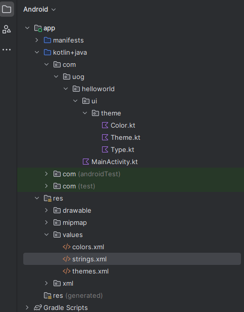

# Introduction to Android Studio

    Course Code: ELEE1146 

    Course Name: Mobile Applications for Engineers

    Credits: 15

    Module Leader: Seb Blair BEng(H) PGCAP MIET MIHEEM FHEA

---

## Meet Android

- Open-source mobile platform
- 11 major platform releases so far
- 2.5 billion monthly active Android devices
- 2+ billion monthly active Google Play users


---

## Meet Android

- **Form Factors**
  - Most popular are Galaxy family, fold, etc
  - OS also powers tablets, netbooks, e-readers, MP4 playert, Smart TVs, Smart white applicances and Vehicles 
- **Emulator**
  - Duplicates how the app looks and feels on a particular device


---

## Monolithic Kernel
- Arm and X86 Architecture
- Android kernel is based on an upstream [Linux Long Term Supported (LTS) kernel](https://www.kernel.org/).
- HAL
  - Hardware abstraction layer provides abstraction for the hardware to kernel (software) using devices drivers and firmware


---

## Versions

- 14 Platform Versions and 34 API levels 

<div align=center >

|Platform Version|	API Level|	VERSION_CODE|Culmative Usage|Year|
|--|--|--|--|--|	
|Android 15.0 |35 | VANILLA ICE CREAM| 0.0% |Q4 2024|
|Android 14.0	|34	|UPDSIDE DOWN CAKE| 25.7% | 2023|	
|Android 13.0	|33	|TIRAMSU|48.0%|2022|
|Android 12.0	|31 - 32	|SNOW CONE|	63.8%|2021|
|Android 11.0	|30	|RED VELVET CAKE|	78.0%|2020|
|Android 10.0	|29	|QUINCE TART|86.0%|2019|
|Android 9.0	|28	|PIE|	91.1%|2018|
|Android 8.0	|26 - 27	|OREO|95.5% - 92.7%|2017|	
|Android 7.0	|24 - 25	|NOUGAT| 97.1% - 95.9%|2016|	

</div>

---

## Programming and Environment

- **Writing Android Apps**
  - `Java` and `Kotlin` are Object-oriented programming languages patterned after the `C++` language
  - You can also write apps in `C++` called native development. 
- **Android Studio**
  - An `integrated development environment (IDE)` for building and integrating application development tools and open-source projects. 
  - Android Studio `IDE` is exclusively dedicated to the purpose of creating Android applications
  - Includes the `Android Software Development Kit (SDK)`

---

## Emulator vs Simulator

- **Simulator**
  -  is designed to create an environment that contains all of the software variables and configurations that will exist in an app's actual production environment. 
- **Emulator**
  - attempts to mimic all of the hardware features of a production environment and software features.

- **Android Emulator**
  - Design, develop, prototype, and test Android apps without using a physical device
  - Mimics almost every feature of a real Android handset, except placing phone calls

---

## What about Kotlin

- Kotlin is an open-source programming language that can run on Java Virtual Machine (JVM). The language can run on numerous platforms.
- It is a language that combines Object Oriented Programming (OOPs) and functional programming in an unrestricted, self-sufficient and distinctive platform.
- In 2019, Google announced Kotlin as its preferred programming language for over 60% of Android application developers.


---

## Getting Oriented with Market Deployment

- Platform consists of the Android OS, application development tools, and marketplace Apps are compiled into package files with an `.apk` extension
- Google Play (http://play.google.com) sells and deploys all apps
- Programs must meet minimum standards
- Apps are free or paid (If you want to charge for your app, the standard split is 70/30 between developer and wireless carrier)
- Also sold through Amazon (amazon.com/appstore) and iTunes (both charge a $99 registration fee)


---

## Opening Android Studio to Create a New Project

- We will be using Android Studio Koala | 2024.1.1 Patch 1 July 11, 2024
- Download and install the Android Studio from https://developer.android.com/studio/archive. 
- Search for th "Android Studio Koala | 2024.1.1 Patch 1 July 11, 2024"
- Make sure you have enough space on the disk, it takes > 3GB and you would also need extra space to run it.


---

## Opening Android Studio to Create a New Project (cont’d)

<div align=center>


</div>

---

## Opening Android Studio to Create a New Project (cont’d)


---

## Opening Android Studio to Create a New Project (cont’d)


---

## Opening Android Studio to Create a New Project (cont’d)


---

## Building the User Interface

- **Must** be intuitive
- Interface **must** not distract from functionality
- Jetpack Compose (new!)
  - Can design interface without writing large amounts of code
- XML (old, like really old!)
  - Java / Kotlin code or XML layout files are needed 

---

## Taking a Tour of the Android Project View

- **Kotlin+Java folder** – contains Kotlin and Java source code
- **Res folder** – contains images, music, and video
- **Manifests folder** – contains the `Android Manifest.xml`, which contains information about the application that Android needs to run



---

## Designing the App


---

## Jetpack Compose

- Is a declarative framework.
- The technique works by conceptually regenerating the entire screen from scratch, then applying only the necessary changes.
- **Composables** execute in any order, and in parallel, be skipped and run frequently 

- Model-View-ViewMode architecture (MVVM)


<!--
Declarative describe your view without relying on mutation and more traditional imperative programming concepts

Compose doesn’t actually rebuild the entire View when you update something. 
It’s smart enough to only change the section that needs to change.

-->
---

## State and Composition

<table width="100%">
<tr>
<td width = "40%">


Key Term:
- **Composition**: a description of the UI built by Jetpack Compose when it executes composables.
- **Initial composition**: creation of a Composition by running composables the first time.
- **Recomposition**: re-running composables to update the Composition when data changes.

</td>
<td>

```kt
@Composable
private fun HelloContent() {
    Column(modifier = Modifier.padding(16.dp)) {
        Text(
            text = "Hello!",
            modifier = Modifier.padding(bottom = 8.dp),
            style = MaterialTheme.typography.bodyMedium
        )
        OutlinedTextField(
            value = "",
            onValueChange = { },
            label = { Text("Name") }
        )
    }
}
```

</td>
</tr>
</table>

---

## Referencing the String


---

## Modifying the Jetpack Compose UI Components


---

## State in composable

<table width="100%">
<tr>
<td width = "40%">

- **Composable functions** can use the `remember` API to store an object in memory. 
- A value computed by `remember` is stored in the Composition during **initial composition**, and the stored value is returned during **recomposition**. 
- `remember` can be used to store both **mutable** and **immutable** objects.
</td>
<td>

```kt
@Composable
fun HelloContent() {
    Column(modifier = Modifier.padding(16.dp)) {
        //val mutableState = remember { mutableStateOf(default) }
        //val (value, setValue) = remember { mutableStateOf(default) }
        var name by remember { mutableStateOf("") }
        if (name.isNotEmpty()) {
            Text(
                text = "Hello, $name!",
                modifier = Modifier.padding(bottom = 8.dp),
                style = MaterialTheme.typography.bodyMedium
            )
        }
        OutlinedTextField(
            value = name,
            onValueChange = { name = it },
            label = { Text("Name") }
        )
    }
}
```

</td>
</tr>
</table>

---

## Modifying the Jetpack Compose UI Components


---


## The Virtual Device

- **Android Virtual Device (AVD)** – Android Studio displays an emulator configuration for design and layout purposes

- Click Device Manager on the menu and Create Virtual Device at the bottom of the screen 


---

## The Virtual Device (Cont’d.)


---
## The Virtual Device (Cont’d.)


---
## Downloading SDK


---
## The Virtual Device (Cont’d.)


---

## Testing the Application in the Emulator

- Step 1:  Tap or click the Run ‘app’ button on the toolbar 
- Step 2: After you have run the app once and have started the emulator, next time around the Run ‘app’ button has changed


---

## Go to for Referencing 

<div style="font-size:27px">

- Android JetPack - [https://developer.android.com/jetpack](https://developer.android.com/jetpack)

- JetPack Compose - [https://developer.android.com/jetpack/androidx/releases/compose](https://developer.android.com/jetpack/androidx/releases/compose)

- API references - [https://developer.android.com/reference](https://developer.android.com/reference)

</div>