# Introduction To Kotlin

    Course Code: ELEE1146 

    Course Name: Mobile Applications for Engineers

    Credits: 15

    Module Leader: Seb Blair BEng(H) PGCAP MIET MIHEEM FHEA

---

## Kotlin


- Created 2010 JetBrains IDE
- Named after Kotlin Island near Finland and Russia
- 2019 Google announced Preferred languages for Android Programming
- 1 Mil GitHub Projects as Primary Language
- 95% of the top 1000 Android Apps are in Kotlin
- Open-Source
- 100% interoperable with Java
- Concise, 40% less code than Java 

<!--

 # WE WILL NOT BE LEARNING JAVA NOT ENOUGH TIME

-->

---

## Naming Conventions

<div class="grid grid-cols-2 gap-4">
<div style="font-size:22px">

- Lower case `lowercase`: `publicdomiansoftware`
  - elements and attributes

- Upper case `UPPERCASE`: `PUBLICDOMAINSOFTWARE`
  - Naming constants

- Camel Case `camelCase`: `publicDomainSoftware`
  - local variable names

- Pascal Case `PascalCase`: `PublicDomainSoftware` 

  </div>

<div style="font-size:22px">

- Snake Case `snake_case`: `public_domain_software`
  -  C/C++ standard library names

- Screaming Snake Case `SCREAMING_SNAKE_CASE`:  `PUBLIC_DOMAIN_SOFTWARE`
  - Naming Constants

- Kebab Case `kebab-case`: `public-domain-software`
  - class names, ids
  
- Screaming Kebab Case `SCREAMING-KEBAB-CASE`:  `PUBLIC-DOMAIN-SOFTWARE`
  - Macros
  
</div>
</div>

---
  
## Primitive Data Types

<div align=center>

|C|Kotlin|Min Value|Max Value|Base|
|---|---|---|---|---|
|`char`|`Byte`|-128|127|$2^7$|
|`unsigned char`| `UByte`|0|255|$2^8$|
|`short`| `Short`|-32768|32767|$2^{16}$|
|`unsigned short`| `UShort`|0|65535|$2^{16}$|
|`int`| `Int`|-2147483648|2147483647|$2^{32}$|
|`unsigned int`| `UInt`|0|4294967295|$2^{32}$|
|`long long`| `Long`|-9223372036854775808|9223372036854775807|$2^{64}$|
|`unsigned long long`| `ULong`|0|18446744073709551615|$2^{64}$|
|`float`| `Float`|-3.4028235E38|3.4028235E38|$2^{32}$|
|`double`| `Double`|-1.7976931348623157E308|1.7976931348623157E308|$2^{64}$|

</div>

<!--

9 Quintrillion... 223 Quadrillion...
-->

---

## Kotlin Naming Convention

<div style="font-size:25px">

- Names of classes and objects start with an uppercase letter and use the camel case:
  ```kt
  open class DeclarationProcessor { /*...*/ }

  object EmptyDeclarationProcessor : DeclarationProcessor() { /*...*/ }
  ```

- Names of functions, properties, and local variables start with a lowercase letter and use the camel case and no underscores:
  
  ```kt
  fun processDeclarations() { /*...*/ }
  var declarationCount = 1
  ```
- Names of constants (properties marked with const, or top-level or object val properties
  ```kt
  const val MAX_COUNT = 8
  val USER_NAME_FIELD = "UserName"
  ```

</div>

---

## Mutable vs Immutable

Two mandatory keywords that must be declared for any variable:

- `val`
  - Essentially this variable is write-protected and once intialised it cannot be modified.
    ```kt
    val a: Int = 1  // val(ue) immediate assignment
    val b = 2       // `Int` type is inferred
    val c: Int      // Type required when no initializer is provided
    c = 3           // deferred assignment
    ```

- `var`
  - This indicates that the variable is re-writeable and can be changed during runtime. 

    ```kt
    var name : String = "Kotlin" //  var(iable) means mutable
    ```

---

## Mutable vs Immutable Part 2

```kt
const val/val myValue: Type = someValue
```
- `const val` - compile-time const value
- `val` - immutable value
- for `const val` use uppercase for naming

```kt
const val NAME = "Kotlin"	        // can be calculated at compile-time
val nameLowered = NAME.lowercase()	// cannot be calculated at compile-time
```

---

## Kotlin: Syntax

```kt
keyword name : dataType = Value
```

```kt
val a: Int = 1	        // immediate assignment

var b = 2		// 'Int' type is inferred
b = a 			// Reassigning to 'var' is okay

val c: Int		// Type required when no initializer is provided
c = 3			// Deferred assignment
a = 4			// Error: Val cannot be reassigned
```

---

## Standard Out (Output)

Explicitly we return information to the interface (CLI, widget,... etc) via standard out. In the case of CLI we use `println()`, a widget for example `button.text`.

```kt
val name : String = "Michail Zarečenskij"
println("Lead Designer: $name")
println("Lead Designer " + name)
print("Lead Designer ") 
println(name)
```

```
Lead Designer: Michail Zarečenskij
Lead Designer is Michail Zarečenskij
Lead Designer Michail Zarečenskij
```
--- 


## Iteration  


A for loop is a fundamental programming construct used for iterating over a sequence of elements, such as arrays, lists, or ranges. It typically consists of three parts: initialization, condition, and iteration.

```kt
for (i in 1..100) { ... }       // closed-ended range: includes 100
for (i in 1..<100) { ... }      // open-ended range: does not include 100
for (x in 2..10 step 2) { ... } // step from 2,4,6,8,10
for (x in 10 downTo 1) { ... }  // step down from a number `x` that is less than 10 down to 1
(1..10).forEach { ... }         // will iterate over 1 to 10, used for objects
```

> `downTo` and `step` are extension functions, not keywords.
`..` is actually `T.rangeTo(that: T)`

---
## `for` Loop Example: 

```kt
for (i in 1...100){
  println("i = $i")
}
```

<details>
<summary>Answer</summary>

As `i` increments from 1 to 100 the `println()` function displays:

```
i = 1
i = 2
...
i = 100
```

</details>

```kt
for (x in 2..10 step 2) { println("x = $x")}
```

<details>
<summary>Answer</summary>

```
x = 2
x = 4
...
x = 10
```

</details>

---

## Kotlin Conditionals

Conditionals use the keywords; `if`, `else if` and `else`
```kt
var x = 10
if (x > 5) {
    println("x is greater than 5")
} else {
    println("x is not greater than 5")
}

x = 10
val message = if (x > 5) {
    "x is greater than 5"
} else if (x < 5) {
    "x is less than 5"
} else {
    "x is equal to 5"
}
println(message)

```
---

## Kotlin Compilation

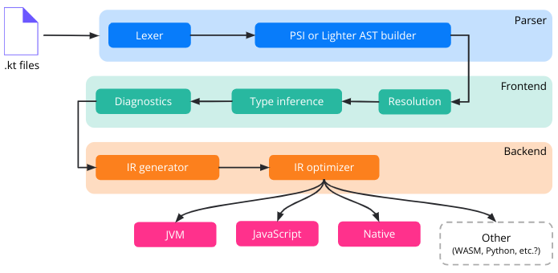

<!--
Looks a bit complex, doesn’t it? Honestly, these blocks could be broken down even further, into even smaller blocks. But this would be difficult and would go beyond the scope of this course.

Let’s start with the parser.
-->

---

## Parser

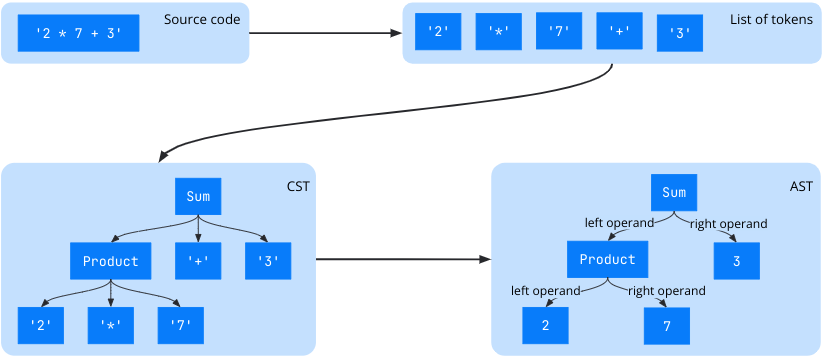

<!--

Then the compiler converts the list of tokens into a CST (a concrete syntax tree)

At last it can convert the CST into an AST (an abstract syntax tree). It’s exactly the same tree,
-->

---

## Function Intermediate Representation (FIR)

In Kotlin, FIR serves as an intermediate representation of Kotlin code that captures the structure and semantics of Kotlin programs in a way that facilitates analysis, transformation, and optimization by various tools such as compilers, IDEs, and static analyzers.

---

## Program Structure Interface (PSI)

The PSI is an abstract syntax tree (AST) representation of a Kotlin program. It captures the structure of the program in a way that is easily accessible for analysis, transformation, and manipulation by various compiler phases and tools.

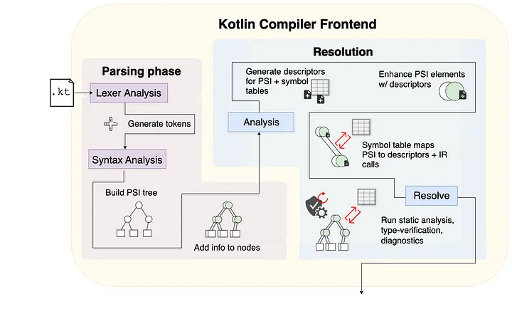

---

## PSI Example 

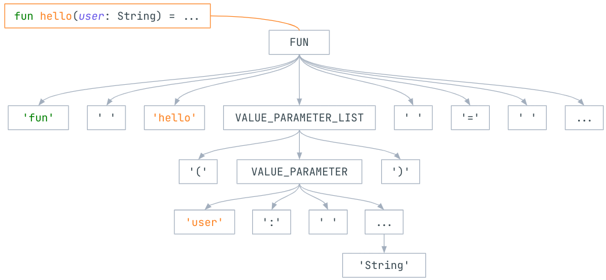

<!--
This is how the sample function definition is divided into tokens and represented as a PSI.

Notice that all symbols are included in the tree, including braces, parenthesis, dots, colons, semicolons, and other symbols that may seem useless in terms of what the code means. But here you won’t find return, public, or any other usually skipped elements because they are skipped. Hence, they are not represented in the CST despite being meant by function declarations. This is because the CST is a representation of the text itself, but not its meaning. All this information is inferred on the frontend only. This phase is only used for transforming plain text into lexical representation. No syntax analysis is performed.

-->

---

## PSI Example 2

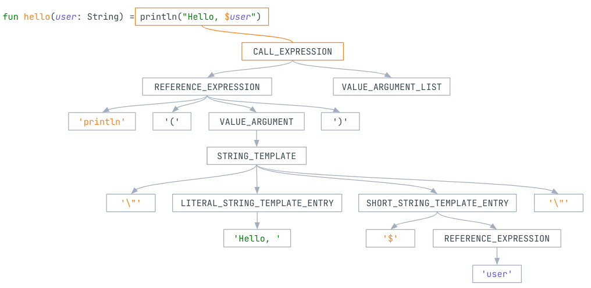

<!--
This is how the sample code (the function) is represented in a PSI. Here the root of the subtree corresponds to the function body.
-->
---

## PSI Example 3

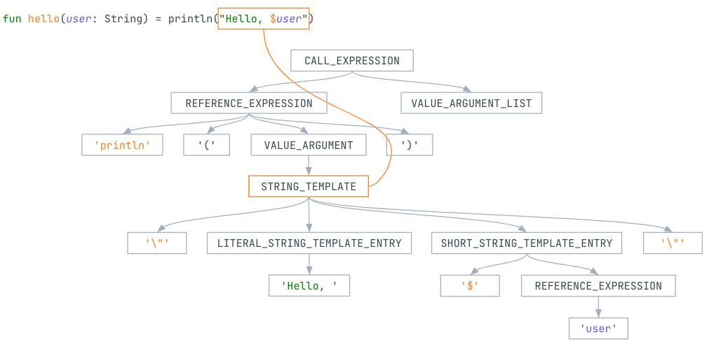

<!--
And the string template that is an argument of println corresponds to the vertex STRING_TEMPLATE. But because it is the only argument of the called function it also corresponds to VALUE_ARGUMENT vertex.
-->

---


## PSI Example 4

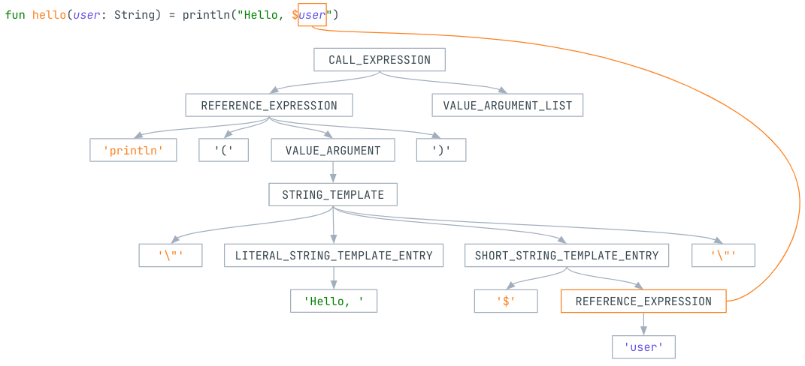

<!--

The usage of the user variable in the string template corresponds to the REFERENCE_EXPRESSION vertex.

-->

---

## Kotlin Compiler: Front End 

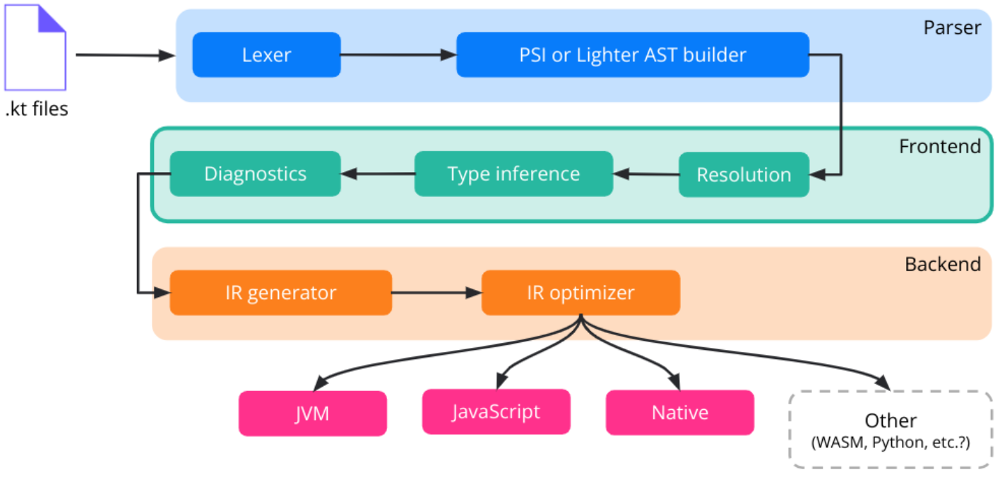

---

## Kotlin Compiler FIR 1

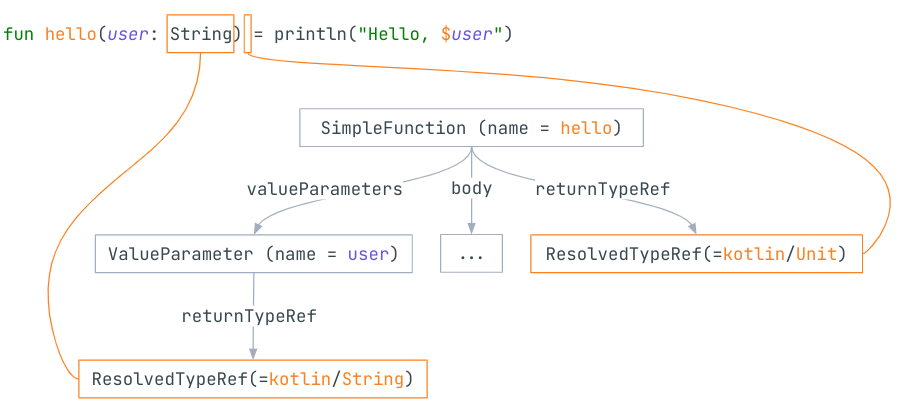

---

## Kotlin Compiler FIR 2

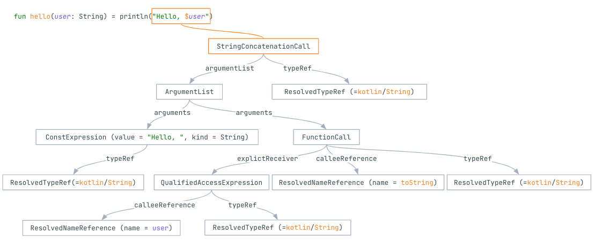

---

## Kotlin Compiler Backend

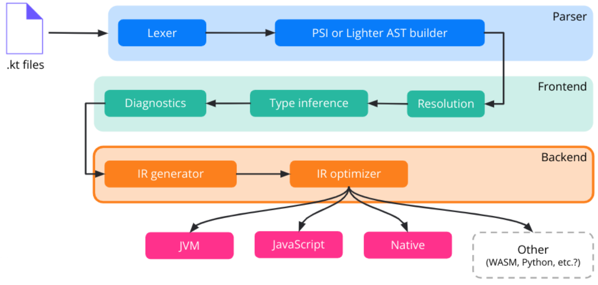

<!--

Lastly, there is the backend. It takes the FIR generated by the frontend and converts it to platform code. On the backend, any extension of the representation, like resolution, is prohibited because it should have been performed on the frontend.

-->

---

## Kotlin Compiler IR

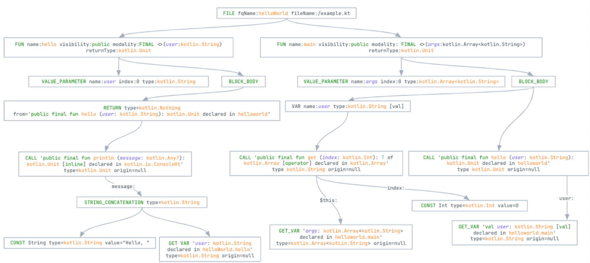

<!--

Here’s the IR of the snippet. Look and be horrified by its complexity!

-->

---

## Kotlin Compiler End

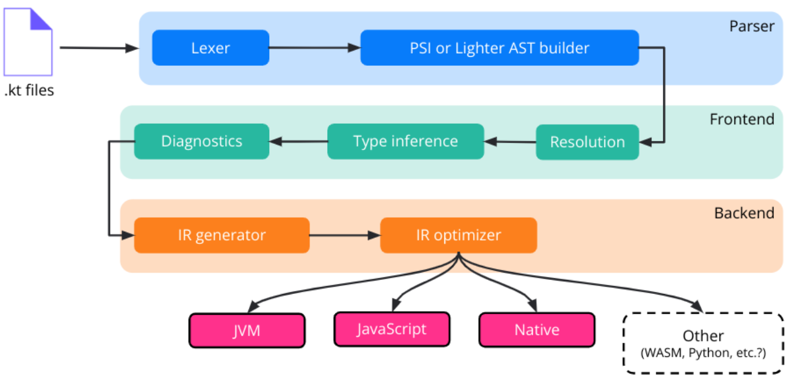

<!--
After the IR is generated and optimized, it is serialized or compiled by a platform-specific backend into a corresponding platform format (Java bytecode for the JVM, JS code – potentially with TS declarations – for the JS platform, machine code for native platforms, etc.).

-->

---

## Kotlin KLibs

JAR analogues – store a serialized IR for the subsequent use of cross-platform libraries.


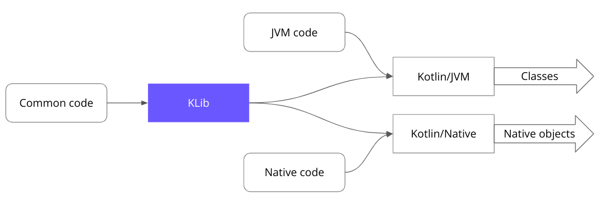

---

## Kotlin ByteCode

<div class="grid grid-cols-1 gap-4">

<div>

```kt
package org.example

fun main() {
    println("Hello World!")
}
```

</div>
<div>

```
public final static main()V
  L0
    LINENUMBER 4 L0
    LDC "Hello World!"
    ASTORE 0
    GETSTATIC java/lang/System.out : Ljava/io/PrintStream;
    ALOAD 0
    INVOKEVIRTUAL java/io/PrintStream.println (Ljava/lang/Object;)V
  L1
    LINENUMBER 5 L1
    RETURN
```
</div>
</div>

<!--
L# - {L}able for an instruction block

LINENUMBER - references the line number from the source code

LDC - This instruction loads a constant value onto the operand stack

ASTORE - stores a reference from the operand stack into a local variable. 

ALOAD -  load a reference from a local variable onto the operand stack.

GETSTATIC - This instruction gets the value of a static field from a class.

INVOKEVIRTUAL - is an instruction used to invoke a virtual method on an object for runtime data type
-->