# Java - Methods, Exception and Error Handiling

    Course Code: ELEE1146 and COMP1836

    Course Name: Mobile Applications for Engineers/Technologists

    Credits: 15

    Module Leader: Seb Blair BEng(H) PGCAP MIET MIEEE MIHEEM FHEA

---


## Methods

- **Method Definition** 
  - Specifies what the method is doing and how to use it consists of method declaration and method body does not execute the statements specified in the method body!
  
-  **Method Invocation (Call)**
   -  specifies how the method should be used (invoked, called) in another method
actually executes the method statements with method arguments provided

---

## Method Definition

- **Method Declaration contains:**
  - access modifiers – optional
  - return type - optional
  - the method identifier 
  - any legal identifier name (Camel case)
    - method arguments (if present) enclosed in brackets  `(` and `)`
    - even when the method have no arguments you must still keep the brackets

- **Method Body:**
  - Enclosed in braces `{` and `}`
  - Consists of statements that specify what the method is doing

---


## Method Declaration

```java
[access modifier] [returnType][static] methodName ([argument list]) 
{	
    declarations
    statements
}

```

- *returnType* is the type of the returned value by the method 	
  - a primitive type – `int`, `char`, `boolean`, etc. or 
  - a predefined class (user defined or from a Java library) – `Font`, `Color`, etc. or 
  - `void` – meaning no value is returned when the method is executed

- *argument list = parameter list*
  - `varType1 varName1`, `…`, `varTypeN varNameN`


---

## Method Body Block

- Method body is a block of code where declarations and/or statements are enclosed in 
`{` and `}`.

- If the method returns a value, e.g. the method *returnValue* is not `void` then the statement `return expression;` should be present in the method body.
  
- The expression type in the `return` statement must be the same as the *returnType* – promotion rules apply.

```java
public float anumber(int num)
{
   return (float)num;
} 
```

---


## Method Innvocation (to call)

- **Method invocation = method call**
  - Actually executes the statements in the body of the method
  - `methodName` ( [argument list] )
    - the values passed as arguments should have the same type as specified in the method declaration - promotion rules 

```java
Graphics g = new Graphics();

g.drawString(“Hello, World!”, 50, 50);

```

---


## Method Innvocation 2

- **Method definition**
```java
public double assessment( byte logBook, byte report, byte test, byte exam) 
{
    return ( 0.2 * logBook + 0.15 * report +  0.15 * test + 0.5 * exam );
}
``` 

- **Method call**
 
```java 
System.out.println(“The result for the assessment of the course is: “ + assessment(45, 55, 60, 50));
```
<details>
<summary>What will be displayed></summary>

`The result of the assessment of the course is: 51.25`

</summary>

---


## Method Innovation 3

- **Method Definition**
```java
static void printResult( String s1, int i1, String s2, int i2 )
{
    System.out.println( s1 + ": " + i1 + ", " + s2 + ": " + i2);
}
``` 

- **Method Call**
```java
printResult(“First number”, -25, “second number”, 10);
```
<details>
<summary>What will be displayed></summary>

`First number: -25, second number: 10`

</summary>

---

## The `main()` method

- Every Java application must contain a main method 
```java
public static void main(String[] args){...}
```
- `public` indicates that the `main` method can be called by any `object`. 
- `static` indicates that the `main` method is a `class` method.  
- `void` indicates that the `main` method doesn't `return` any value. 

---
## How the `main()` method gets called?

- When the Java interpreter executes an application it starts by calling the class `main` method

- The `main` method then calls all the other methods required to run your application

- The `main` method in the Java language is similar to the main function in C,C++ and C# and many others.

---

##  Events

An ***event*** is an action initiated by the user interacting with the program.

- **Examples:**
  - Keyboard events - pressing a key, holding a key, releasing a key
  
  - Mouse events - moving the mouse, clicking the mouse
  
  - GUI events - clicking on a button, resizing a window, closing a window, opening a window
  
  - An ***event*** in Java is an object of a particular event class, that represents some user actions to which the GUI might respond

---

## Low Level Events

- Low level events represent direct communication from the user
- Low level event examples (all the event classes listed below belong to the `java.awt.event` package):
  - *key event* - a keyboard key pressed or released - in the `KeyEvent` class
  - *focus event* – a component got focus, lost focus – in the `FocusEvent` class
  - *mouse event* - the mouse is moved or dragged, a mouse button is pressed or released, the mouse cursor enters or exits a component - in the `MouseEvent` class
  - *component event* - a component is hidden, shown, resized, or moved – in the `ComponentEvent` class
  - *container event* - a component is added to or removed from a container in the `ContainerEvent` class
  - *window event* - a window is opened, closed, activated, deactivated, etc. - in the `WindowEvent` class

---

## High Level Events

- High level (semantic) events encapsulate the meaning of a user interface component
- High level events usually involve one or more low level events
- High Level Event examples
  - *action event* - do a command – `ActionEvent` class
  - *adjustment event* -  represents scrollbar motions such as a value was adjusted – `AdjustmentEvent` class
  - *item event* - occurs when the user selects a checkbox, choice, or list item, i.e. item state has changed `–ItemEvent` class
  - *text event* – represents a text component content (value) change – `TextEvent` class

---

## How Do the Low and High Level Events Work in Java?

- When the user clicks the mouse on a button, then releases it, the button gets two or three separate, low level mouse events
- one for mouse down 
- one for mouse up
- possibly one for mouse drag (if the user moves the mouse while the button is pressed)

- However, the button then fires one high level event only - `ActionEvent`

---

## Event Driven Interfaces

- An *event-driven* system waits for something to happen (an event) in the environment.
- Event-driven application - an input-output model in which the application implements an event loop
  - waits for an event to occur
  - responds to the event
  - waits for the next event and so on …
  - GUIs are *event-driven* - they generate events  when the user interacts with the GUI
---

## Event Driven Programming

- In event *driven programming* the events "drive" the execution of the program, e.g. the code is executed when events are activated

- The program interacts with the user and  generates events based on the external user actions

- Java Visual (Graphical) programming is event driven

---

## Java Event Delegation Model (1)

- Java uses *delegation-based* model for event handling

- Java uses event listener to register an event and event handler to respond to the event

- The use of event listeners in event handling is called *delegation event model *

---

## Java Event Delegation Model Diagram



---

## Exceptions

>"Computer says, no!"

- compilation errors & run-time errors
- *exception* - error in the program that occurs 
   during its execution and disrupts the normal
   flow of instructions. 
- *exception* is a shorthand for an exceptional event. 
- Examples: 
  - division by zero
  - trying to access an out-of-bounds array elements
  - trying to open a file that does not exists, etc. 

## Exception Handling

- Enable programs to catch and handle errors

- Used in situations when the system could recover from the malfunction causing the exception

- Exception handling is a recovery (from an error in the program) procedure 

- *Exception handler* is the code that executes when an exception has been detected.

---

## Exceptions in Java 

- An exception in Java is represented by an object

- Java has various predefined classes for different exceptions that can occur during execution time

- Exceptions are *thrown* by a program, and may be caught and handled by another part of the program

- A program can be separated into a normal execution flow and an *exception execution flow*

---

## Java Exception Handling 

1. A method detects an error.
 
2. The method *throws an exception*.

3. The exception is *caught* and *handled* by an exception handler. 

---

## Java Exception Handling Example (1)

```java
import javax.swing.*;

public class Division{
  	public static void main(String args[]){

	   int number1, number2, result;
	   String firstNumber, secondNumber;

        firstNumber = JOptionPane.showInputDialog("Enter first integer");
	   secondNumber = JOptionPane.showInputDialog("Enter second integer");

	   number1 = Integer.parseInt(firstNumber);
	   number2 = Integer.parseInt(secondNumber);
	   result = number1 / number2;

	   JOptionPane.showMessageDialog(null, "The result is " + result, "Result", JOptionPane.PLAIN_MESSAGE);

 	   System.exit(0);
   }
}  
```


---

## Java Exception Handling Example (2)

```java
import javax.swing.*;

public class Division {

  	public static void main(String args[]){

	   int number1, number2, result;
	   String firstNumber, secondNumber;
	   firstNumber = JOptionPane.showInputDialog("Enter first integer");
	   secondNumber = JOptionPane.showInputDialog("Enter second integer");

	   try {
                number1 = Integer.parseInt(firstNumber);
                number2 = Integer.parseInt(secondNumber);
                result = number1 / number2;
                JOptionPane.showMessageDialog(null, "The result is " + result,
                    "Result", JOptionPane.PLAIN_MESSAGE);
	   }
	   catch(NumberFormatException nfe){
                JOptionPane.showMessageDialog( null,
                "You must enter two integers!","Invalid Number Format", JOptionPane.ERROR_MESSAGE );
	   }
	   catch (ArithmeticException ae){
                JOptionPane.showMessageDialog( null, 
                "Second number should not be zero!", "Division by zero",
                JOptionPane.ERROR_MESSAGE );
	   }
	   System.exit ( 0 );
   }
}
```