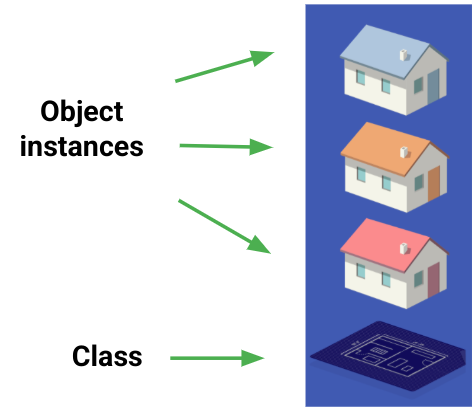
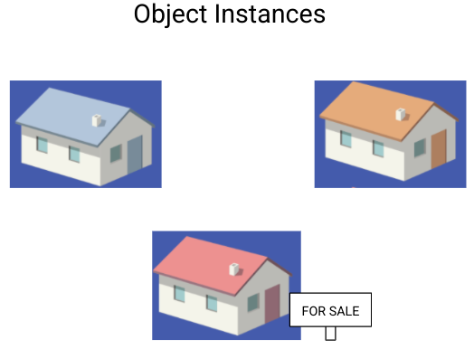
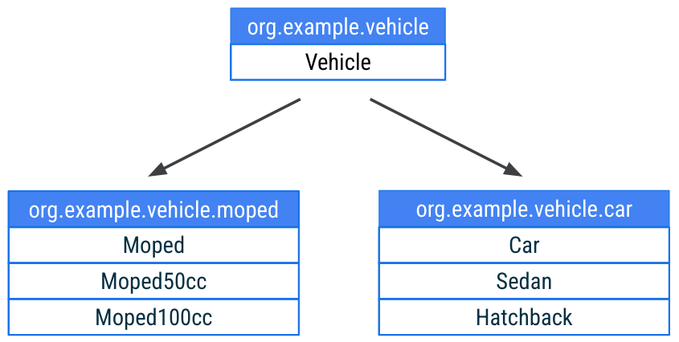

# Object Orientated Programming

    Course Code: ELEE1146 

    Course Name: Mobile Applications for Engineers

    Credits: 15

    Module Leader: Seb Blair BEng(H) PGCAP MIET MIEEE MIHEEM FHEA

---

## OOP Key Concepts

- Classes and Objects

- Functions and Methods

- Encapsulation

- Inheritance 

- Polymorphism

- Interfaces 

---

## Classes

**Classes** are software programming models - abstractions of the real world or system entities. 

**Classes** define methods that operate on their object instances




<!--

- Classes have *state* and *behaviour*

- *Variables* are used to describe the state of the class and methods are used to describe behaviour

- Classes are collections of objects with common structure, common behaviour, common relationships and common semantics

- Objects belong to a particular class, objects are instances of a particular class 

-->

---

## Classes vs Objects (2)

**House Class**
- Data
    - House color (`String`)
    - Number of windows (`Int`)
    - Is for sale (`Boolean`)

- Behavior
    - `updateColor()`
    - `putOnSale()`




<!--

The House class contains a blueprint of what goes into a House. It has properties like color (which is a String), number of windows (an Int), and whether or not the house is for sale (a Boolean).

The House class also contains methods like updating the house color or putting the house on sale.

We use the class to create object instances of the class. On the right are 3 different House object instances that have different attributes. They have different colors and one is even for sale.

-->

---

## Class - an Example

**Class Definition**

```kt
class House {
  val color: String = "white"
  val numberOfWindows: Int = 2
  val isForSale: Boolean = false

  fun updateColor(newColor: String){...}
  ...
}
```

**Object Creation**

```kt
val myHouse = House()
println(myHouse)
```
---

## Constructors

When a constructor is defined in the class header, it can contain:

- No parameters
  `class A`

- Parameters
  
  - Not marked with var or val → copy exists only within scope of the constructor
  `class B(x: Int) `
  
  - Marked var or val → copy exists in all instances of the class
  `class C(val y: Int)`


---


## Constructors Examples

class `A`
```kt
val aa = A()
```

class `B (x: Int)`
```kt
val bb = B(12) 
println(bb.x) 
=> compiler error unresolved reference
```
class `C(val y: Int)`

```kt
val cc = C(42)
println(cc.y)   
=> 42
```

<!--

These are different examples of how you can define constructors with or without parameters.

The constructor for class A has no parameters. 

The constructor for class B has 1 input parameter: x which is an Int. Because the parameter is not marked as a var or val, the variable x does not exist outside the scope of the constructor. Hence, if we create an object instance called bb, and we try to call the property x on it, we will get a compiler error. The property x does not exist on the object.

In the third case, we have a constructor for class C with 1 input parameter: a val called y. If you create an object instance called cc, you can access the property y which has the value of 42 in this case. 

To summarize, you can define the properties directly within the constructor, using var or val (as seen in the third example).

-->

---

## Parameters

Class instances can have default values.
  - Use default values to reduce the number of constructors needed

  - Default parameters can be mixed with required parameters 

  - More concise (don’t need to have multiple constructor versions)


```kt
class Box(val length: Int, val width:Int = 20, val height:Int = 40)
val box1 = Box(100, 20, 40)
val box2 = Box(length = 100)
val box3 = Box(length = 100, width = 20, height = 40)
```
---

## Primary Constructor

Declare the primary constructor within the class header.

```kt
class Circle(i: Int) {	
   init {
        ... 
   }
}
```

This is technically equivalent to:

```kt
class Circle {
    constructor(i: Int) {
        ...
    }
}
```

---

## Initialiser Block 

- Any required initialization code is run in a special `init` block 

- Multiple `init` blocks are allowed

- `init` blocks become the body of the primary constructor

  ```kt
  class Square(val side: Int) {
      init {
          println(side * 2)
      }
  }

  val s = Square(10)
  => 20
  ```

---

## Multiple Constructors

- Use the `constructor` keyword to define secondary constructors

- Secondary constructors must call:

  - The primary constructor using `this` keyword 


- Secondary constructor body is not required
```kt
class Circle(val radius:Double) {
    constructor(name:String) : this(1.0)
    constructor(diameter:Int) : this(diameter / 2.0) {
        println("in diameter constructor")
    }
    init {
        println("Area: ${Math.PI * radius * radius}")
    }
}
val c = Circle(3)
```

<!--
In the Circle class, we have a primary constructor (that takes a double radius value as input) and 2 secondary constructors. 

To define a secondary constructor, start with the constructor keyword followed by parameters, a colon, and a call to the default constructor with this (which takes the radius as input). For classes with multiple constructors like this one, the init block runs before any code in the secondary constructor. Hence, the println statement will be executed before any of the code within the secondary constructors. 

-->

---

## Properties

- Define properties in a class using `val` or `var`

- Access these properties using

- dot `.` notation with property name

- Set these properties using dot `.` notation with property name (only if declared a `var`)


```kt
class Person(var name: String)
fun main() {
    val person = Person("A Name")
    println(person.name)           // Access with .<property name>
    person.name = "Your Name"           // Set with .<property name>
    println(person.name)	
}
```

---

## Setters and Getters

If you don’t want the default `get`/`set` behavior:

- Override `get()` for a property 
- Override `set()` for a property (if defined as a `var`)

```kt
class Person(val firstName: String, val lastName:String) {
    val fullName:String
        get() {
            return "$firstName $lastName"
        }
}
```
```kt
val person = Person("Your", "Name")
println(person.fullName)
=> Your Name
```

---
## Custom Setter

```kt
var fullName:String = ""
    get() = "$firstName $lastName"
    set(value) {
        val components = value.split(" ")
        firstName = components[0]
        lastName = components[1]
        field = value
    }
```

```kt
person.fullName = "Marshall Mathers"
```
---

## Inhertiance

- Kotlin has single-parent class inheritance

- Each class has exactly one parent class, called a superclass

- Each subclass inherits all members of its superclass including ones that the superclass itself has inherited

> If you don't want to be limited by only inheriting a single class, you can define an `interface` since you can implement as many of those as you want.

---

## Interfaces 

- Provide a contract all implementing classes must adhere to 

- Can contain method signatures and property names 

- Can derive from other interfaces 

```kt
interface Shape {
    fun computeArea() : Double
}
class Circle(val radius:Double) : Shape {
    override fun computeArea() = Math.PI * radius * radius
}
```
```kt 
val c = Circle(3.0)
println(c.computeArea())
=> 28.274333882308138
```
---

## Extending Classes

To extend a class: 

- Create a new class that uses an existing class as its core (subclass)

- Add functionality to a class without creating a new one (extension functions)

- Kotlin classes by default are not subclassable 

- use keyword `open` to allow subclassing

- Properties and functions are redefined with the override keyword 

---

## Classes are Final

- Declare a class
   `class A`

- Try to subclass A
   `class B : A`

  `=>Error: A is final and cannot be inherited from`

- Use `open` to declare a class so that it can be subclassed.

  - Declare a class
   `open class C`

  - Subclass from C
   `class D : C()`

---

## Abstraction

- Class is marked as `abstract`

- Cannot be instantiated, must be subclassed 

- Similar to an interface with the added the ability to store state 

- Properties and functions marked with `abstract` must be overridden 

- Can include non-abstract properties and functions 

---

## Abstraction Example

```kt
abstract class Food {
    abstract val kcal : Int
    abstract val name : String
    fun consume() = println("I'm eating ${name}")
}

class Pizza() : Food() {
    override val kcal = 600
    override val name = "Pizza"
}

fun main() {
    Pizza().consume()    // "I'm eating Pizza"
}
```

---

## Special Classes

- **`Data` Class:** 
  - Special class that exists just to store a set of data 
  - Mark the class with the `data` keyword
  - Generates getters for each property (and setters for vars too)
  - Generates `toString()`, `equals()`, `hashCode()`, `copy()` methods, and destructuring operators

Define the data class:

```kt
data class Player(val name: String, val score: Int)

val firstPlayer = Player("Lauren", 10)
println(firstPlayer)
=> Player(name=Lauren, score=10)
```
<!--
Data classes make your code much more concise!
-->
---

## Pair and Triple ~~Tuple~~

- Pair and Triple are predefined data classes that store 2 or 3 pieces of data respectively

- Access variables with `.first`, `.second`, `.third` respectively 

- Usually named data classes are a better option (more meaningful names for your use case)

```kt
val bookAuthor = Pair("Harry Potter", "J.K. Rowling")
println(bookAuthor)
=> (Harry Potter, J.K. Rowling)

val bookAuthorYear = Triple("Harry Potter", "J.K. Rowling", 1997)
println(bookAuthorYear)
println(bookAuthorYear.third)
=> (Harry Potter, J.K. Rowling, 1997)
    1997
```
---

## Pair to.. 

Pair's special to variant lets you omit parentheses and periods (infix function).

More readable

```kt
val bookAuth1 = "Harry Potter".to("J. K. Rowling")
val bookAuth2 = "Harry Potter" to "J. K. Rowling"
=> bookAuth1 and bookAuth2 are Pair (Harry Potter, J. K. Rowling)
```

Also used in collections like Map and HashMap

```kt
val map = mapOf(1 to "x", 2 to "y", 3 to "zz")
=> map of Int to String {1=x, 2=y, 3=zz}
```
---

## `Enum` Class

User-defined data type for a set of named values

- Use `this` to require instances be one of several constant values 

- The constant value is, by default, not visible to you 

- Use `enum` before the class keyword


Define an enum with red, green, and blue colors.


```kt
enum class Color(val r: Int, val g: Int, val b: Int) {
   RED(255, 0, 0), GREEN(0, 255, 0), BLUE(0, 0, 255)
}

println("" + Color.RED.r + " " + Color.GREEN.g + " " + Color.BLUE.b)
=> 255 255 255
```
---

## Companion objects

- Lets all instances of a class share a single instance of a set of variables or functions 

- Use `companion` keyword

- Referenced via `ClassName.PropertyOrFunction` 

```kt
class PhysicsSystem {
    companion object WorldConstants {
        val gravity = 9.8
        val unit = "metric"
        fun computeForce(mass: Double, accel: Double): Double {
            return mass * accel
        }
    }
}
println(PhysicsSystem.WorldConstants.gravity)
println(PhysicsSystem.WorldConstants.computeForce(10.0, 10.0))
=> 9.8100.0
```
---

## Packages

- Provide means for organization

- Identifiers are generally lower case words separated by periods

- Declared in the first non-comment line of code in a file following the package keyword

- package `org.example.game`

---

## Example class hierarchy



---

## Visibility modifiers

Use visibility modifiers to limit what information you expose.

- `public` means visible outside the class. Everything is public by default, including variables and methods of the class.


- `private` means it will only be visible in that class (or source file if you are working with functions).


- `protected` is the same as `private`, but it will also be visible to any subclasses.

<!--
## Encapsulation (1)

- Any changes to the object's state (i.e. its variables) should be made only via that object's methods

- We should make it difficult, if not impossible, to access an object’s variables other than via its methods

- The user can request the object’s services, but s/he should not have to be aware of how those services are implemented

---

## Encapsulation (2)

- Data and methods are tied together in classes in OOP, i.e. classes *encapsulate* data representation and behaviour

- The user can view an object as a black box - s/he is not interested in the implementation but in the *interfaces* to the object

- information hiding - implementation details are hidden within the classes using `private` keyword
  - Examples - car, TV set, domestic appliances

---

## Encapsulation (3)

Encapsulation principle means that we should add to the same class behavioral methods (drive, stop, etc.).

<div align=center>


</div>

---

## Visibility Modifiers

- Access modifiers are a means of hiding the implementation details within a class
- Access modifiers specify levels of access control to and the visibility of class variables and methods
- Access modifier’s type:
  - `open` (default, no keyword) - can be accessed from everywhere (implicit)
  - `private` - can only be accessed by the methods/functions inside the class definition
  - `internal`  - can only be accessed by other classes in the same package
  - `protected` - can only be accessed by other classes in the same package or by subclasses of the class

---

## Class - Example


```kt
// class Student definition
class Student {
    private var name: String? = null  
    private var IDNumber: Int? = null
    private var programme : String? = null
    private var year : Byte? = 0

    // method declaration
    fun assessment( logBook: Byte, report : Byte, test : Byte, exam : Byte ) : Double
    {
        return ( 0.2 * logBook + 0.15 * report + 0.15 * test + 0.5 * exam )
    }                       
}
 ```


```kt
var student : Student() // object declaration
printf(student.assessment(50,50,50,50))
```

---
## Access to the Private Members of a Class

- The access and any changes to the private instance variables values are implemented via methods

- Methods:
  - *mutator methods* - to change the value of an instance variable - also called set methods
  - *accessor methods* (query methods) -  to obtain the value of private instance variable - also called get methods
  - *constructors* – a specific type of mutator methods used to give initial values to objects

---

## Example - Set Methods

```kt
class Point  {
   private var x : Int? = null
   private var y : Int? = null  
   private fun setX( x1: Int) { this.x = x1 }
   private fun setY( y1: Int) { this.y = y1 }
   fun setPoint ( x: Int, y: Int ) {
      setX( x ); setY ( y );
   }
   fun printPointCoord () {
    print("x=${this.x}, y=${this.y}")
   } 
}
```

---

## Constructors

- Constructors are methods that initialise object instance variables

- They are invoked automatically each time an object of that class is instantiated

- The name of the constructor has to be the same as the class name (case sensitive), `constructor` is the keyword too for ease of rememberance.

- Constructors do not specify return values as the `object` is returned data type

---

## Constructor Example

```kt
class BankCustomer  {
   private var accNumber : Int? = null; private var pin : Int? = null
   private var firstName : String? = null; private var lastName: String? = null
   private var balance : Double? = null;
   // constructor   
   constructor(){
     setBankCustomer ( 0, 0,"","",0.0 );   
   }

    // set method
    private fun setBankCustomer ( acc: Int, p: Int, fn : String, ln : String, bal: Double ) { 
        this.accNumber = acc; this.pin = p;
        this.firstName = fn;  this.lastName = ln;
        this.balance = bal;                
    }
    
    fun customerToString() : String {
        return ( "$accNumber $firstName $lastName £$balance" );
    }
}
```

--- 

## Constructor Overloading

```kt
class BankCustomer  {
   private var accNumber : Int? = null; private var pin : Int? = null
   private var firstName : String? = null; private var lastName: String? = null
   private var balance : Double? = null;
   
   // constructor   
   constructor()  {
     setBankCustomer ( 0, 0,"","",0.0 );   
   }
   // second constructor
   constructor( acc: Int, p : Int, bal: Double )  {
      setBankCustomer( acc, p,"", "", bal );
   }
   // third constructor   
   constructor( acc : Int, p : Int, fn : String, ln : String, bal : Double )  {
      setBankCustomer( acc, p, fn, ln, bal );
   }
   ...
}
```

---

## Constructor Invocation

```kt
class BankCustomerTest 
{
  fun main(args: Array<String>) {
    //declaration and initialisation
    var cust1 : BankCustomer = BankCustomer(12312124,1234,0.0)
    var cust2 : BankCustomer = BankCustomer(12318888,1104, "First","Last",1200.00)
    var cust3 : BankCustomer = BankCustomer()
    
    //Print accout information
    println("Information for :\n\n");
    printBankCustomer (1, cust1 );
    printBankCustomer (2, cust2 );
    printBankCustomer (3, cust3 );
  }

  fun printBankCustomer(number: Int, cust: BankCustomer) {
      println("${number} ${cust.customerToString()}")
  }
}
```

---

## Set Methods

```kt
class BankCustomer  {
   private var accNumber : Int? = null; private var pin : Int? = null
   private var firstName : String? = null; private var lastName: String? = null
   private var balance : Double? = null;
   // 3 constructors // same as before
   public BankCustomer ()  
   { ... }
   ...
   fun setAccount ( acc : Int ) {  
      this.accountNumber = acc;   
   }
   fun setPIN ( p: Int ){
      this.pin = p;   
      }
   fun setName (fn : String, ln : String ){  
      this.firstName = fn; this.lastName = ln;  
    }
   fun setBalance ( bal : Double ){  
      this.balance = bal;   
    }
}
```
---

## Get Methods

```kt
class BankCustomer {
   private var accNumber : Int? = null; private var pin : Int? = null
   private var firstName : String? = null; private var lastName: String? = null
   private var balance : Double? = null;
   // 3 constructors // same as before
   public BankCustomer ()  
   { ... }
   ...
   // no getPIN method !!! 
   fun getAccount(): Int  { 
      return this.accountNumber;  
   }
   fun getFirstName() : String  { 
     return this.firstName; 
   }     
   fun getLastName() : String  { 
     return this.lastName; 
   }
   fun getBalance() : Double  { 
     return this.balance; 
   }
}
```

---

## Inheritance (1)

- Reuse do not reinvent!

- By using existing software components to create new ones, we take advantage of all the effort that went into the design, implementation, and 

- testing of the existing software

- Inheritance is the main idea behind existing classes in Java libraries - use them and adapt them to your own needs


---

## Inheritance (2)

- Inheritance allows a software developer to derive a new class from an existing one

- The new class (also called the child) inherits characteristics of the parent, i.e. the child inherits the methods and data defined in the parent class

- The original class is called superclass (base class, parent) 

- The new class is called subclasses (derived class, child)

- To tailor a derived class, the programmer can add new variables or methods, or can modify the inherited ones

---

## Single & Multiple Inheritance 

- Depending on the number of the superclasses a subclass is derived from the inheritance could be:
  - single inheritance - a subclass is derived from just one superclass, i.e. a child class can have only one parent class or
  - multiple inheritance - a subclass is derived from more than one superclass, inheriting the members of all parents, i.e. a child class can have two or more parents classes 
    - Example: family tree

---

## Single Inheritance in Kotlin

We are using the keyword extends in Kotlin to implement single inheritance

Example	

```kt
  //    SubClass  SuperClass            
  class MyClass : Applet() {
     // ...some code...
   }
```

---

## Multiple Inheritance in Kotlin

- No “classical” multiple inheritance of classes in Kotlin, e.g. a class can not be derived from multiple classes
 
```kt
MyClass : Applet(), ActionListener(), ItemListener()  {
     		// ...some code...
  }
```

---

## Polymorphism

- From Greek, means “many forms”

- Allows us to process objects of all existing classes in a hierarchy in an uniform manner

- The main idea behind polymorphism is to have just one interface and multiple methods 

- The concept of polymorphism  let us use same name for more than one different purpose

- Example: overloaded constructors – same name, different parameters
This approach can be applied to every other method!


---

## Polmorphism 2

```kt
open class Shapes {
  open fun area() {
    println("The formula for area of ")
  }
}

class Triangle : Shapes() {
   override fun area() {
    println("Triangle is ½ * base * height ");
  }
}

class Circle : Shapes() {
  override fun area() {
    println("Circle is 3.14 * radius * radius ");
  }
}

fun main(args: Array<String>) {
    val myShape = Shapes()  // Create a Shapes object
    val myTriangle =  Triangle()  // Create a Triangle object
    val myCircle = Circle()  // Create a Circle object
    myShape.area()
    myTriangle.area()
    myShape.area()
    myCircle.area()
}
```
-->


## Method vs Function

**Method**: a set of instructions that are associated with an object.
```kt
var s: String = "some string"

s.toCharArray() 
```

**Function**: a set of instructions that perform a task.
```kt
fun concatName(firstName : String, middleName: String, lastName: String) : String {
    return "$firstName $middleName $lastName"
}

val fullName : String = concatName("Marshall", "Bruce", "Mathers")
```
---

## Function

- **Function Definition** 
  - Specifies what the method is doing and how to use it consists of method declaration and method body does not execute the statements specified in the method body!
  
-  **Function Invocation (Call)**
   -  specifies how the method should be used (invoked, called) in another method
actually executes the method statements with method arguments provided

---

## Function Definition

- **Function Declaration contains:**
  - access modifiers – optional
  - return type - optional
  - the method identifier 
  - any legal identifier name (Camel case)
    - method arguments (if present) enclosed in brackets  `(` and `)`
    - even when the method have no arguments you must still keep the brackets

- **Function Body:**
  - Enclosed in braces `{` and `}`
  - Consists of statements that specify what the method is doing

---


## Function Anatomy

```
FUNCTION HEADER
<visibility modifiers>[fun keyword][function name]<(function parameters)><:return type>
{
  ...                  FUNCTION BODY
  <return type>
}
```

**Example**

```kt
private fun myFunction(s: String, n: Int) : Boolean
{
  ...
  return Boolean
}
```

---

## Function Body Block

<div style="font-size: 26px">

- Function body is a block of code where declarations and/or statements are enclosed in 
`{` and `}`.

- If the Function returns a value, e.g. the method *returnValue* then the statement `return expression` should be present in the method body.
  
- The expression type in the `return` statement must be the same as the *returnType* – casting rules apply.

</div >

```kt
private fun myFunction(s: String, n: Int) : Boolean
{
  if(s.toIntOrNull() != null && s.toIntOrNull() == n ){
      return true
  }
  else {
      return false
  }
}
```
---

## Function Innvocation (to call)

- **Function invocation (call)**
  - Actually executes the statements in the body of the function
  - `functionName` ( [argument list] )
    - the values passed as arguments should have the same type as specified in the function declaration - casting rules 

  ```kt
  fun concatNameAndAge(firstName : String, middleName: String, lastName: String, age: Int) : String 
  {
      return "$firstName $middleName $lastName : $age:"
  }

  val fullName : String = concatName("Marshall", "Bruce", "Mathers", (25.0).toInt)
  ```
---


## Function Innvocation 2

- **Function definition**
```kt
fun assessment( assessmentOne: Byte, assessmentTwo: Byte ) : Double
{
    return ( (0.3 * assessmentOne) + (0.7 * assessmentTwo) )
}
``` 

- **Function call**
 
```kt
print("Your module result is:  $assessment(45, 55))
```
<details>
<summary>What will be displayed</summary>

`The result of the assessment of the course is: 52.0`

</summary>

---


## Function Innovation 3

- **Function Definition**
  ```kt
  internal private fun printResult( s1 : String, i1 : Int, s2 : String, i2: Int )
  {
      println( "$s1 : $i1, $s2 : $i2");
  }
  ``` 

  <!--
  internal means that the declarations are visible inside the module only 
  -->

- **Function Call**

  ```kt
  printResult("First number", -25, "second number", 10);
  ```

  <details>
  <summary>What will be displayed</summary>

  `First number: -25, second number: 10`

  </summary>

---