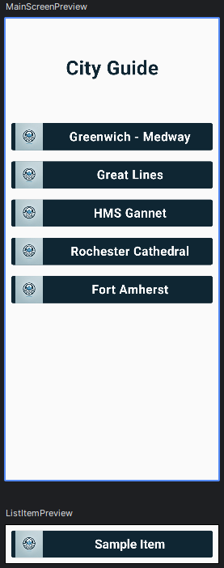
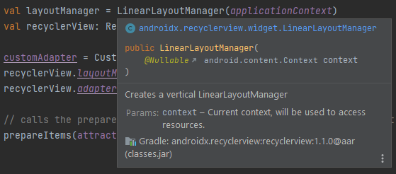
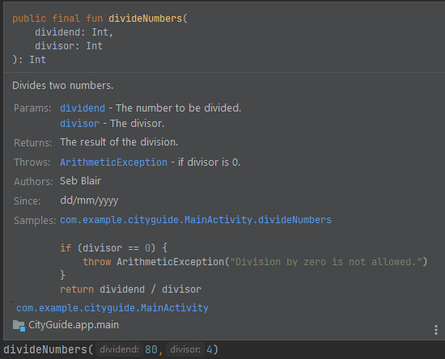
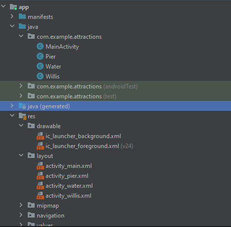

# Android Lists Arrays and Web Browsers

    Course Code: ELEE1146 

    Course Name: Mobile Applications for Engineers

    Credits: 15

    Module Leader: Seb Blair BEng(H) PGCAP MIET MIHEEM FHEA

---


## Lazy lists

- `column` and `row` are good for a known length of items, generally of size less than 10 
  - Performance issues aas all items are composed and laid out despite not being in view!

- LazyColumn & LazyRow
  - Dynamic or larger number of items, as only items in components viewport are composed.



---

## Example LazyColumn

```kt

@Composable
fun ItemList(items: List<String>, onItemClick: (Int) -> Unit){
    LazyColumn {
        itemsIndexed(items){index, item ->
            ListItem(item = item, onClick = {onItemClick(index)})
        }
    }
}

@Composable
fun ListItem(item: String, onClick: () -> Unit){

    Row (...){
        Spacer(modifier = Modifier.width(8.dp))
        Image( ... )
        Spacer(modifier = Modifier.width(8.dp))
        Text( ... )
    }
}
```


--- 

## Creating an Array 
- Array variables can store more than one value
- Different from other data types that can hold only one value
- Each individual item in an array is called an element
- Refer to each element using an index in the array

<div align=center>

|Element| Value|
|---|---|
|attaction[0]| Greenwich - Medway |
|attaction[1]| Great Lines |
|attaction[2]| HMS Gannet |
|attaction[3]| Rochester Cathedral  |
|attaction[4]| Fort Amherst  |

</div>

---

## Declaring an Array

- `arrayOf(value,value2,value3)` implictly sets the array data type to that supplied
- `Array<T>(size){value;value2;value3}` explicit size and Type
- Attribute 
`arrayName.size` total number of elements

Code Syntax:

```kt
val attractions = arrayOf("Greenwich - Medway","Great Lines",
        "HMS Gannet","Rochester Cathedral","Fort Amherst")
```

or

```kt
val attractions = Array<String?>(5){"Greenwich - Medway";"Great Lines",
        "HMS Gannet";"Rochester Cathedral";"Fort Amherst"}
```

---

## Arrays [1]

- Definition
  - Arrays are data structures consisting of data items of the same type packaged together under one name.

- An array has:
  - elements have: 
    - positions (indices)  in the array

<div align=center>

|27|-7|0|16|38|40|16|77|16|
|--|--|--|--|--|--|--|--|--|
|c[0]|c[1]|c[2]|c[3]|c[4]|c[5]|c[6]|c[7]|c[8]|

</div>

`c[]` array elements, `c` array name

---

## Array [2]


**Declaration**
- `var arrayName: Array<arrayType>`

- **Allocation - as an object**
  - `arrayName = Array(arraySize) { value } (arraySize is a positive number)`

- **Initialization**
  - `var arrayName = arrayOf(value1, value2, … , valueN)`


---

## Array [3]

Example 1:
```kt
var c: Array<Int> // declares the array
c = Array(8) { 0 } // allocates the memory
```


Example 2:
```kt
// declares the array and allocates memory for its elements
var b = Array(100) { 0.0 }
var s = Array(5) { "" }

```

---

## Arrays [4]

- Combining declaration and initialisation

```kt 
val daysOfTheWeek = arrayOf("Monday", "Tuesday", "Wednesday", "Thursday", "Friday", "Saturday", "Sunday")

```

- `arrayName.size` = the number of the elements in the array
```kt
val length = daysOfTheWeek.size // length = 7
```

---

## Arrays [5] - Initialisation

- In the declaration
  ```kt
  var a = arrayOf(0, 0, 0, 0, 0, 0)
  val length = a.size // length is equal to 6
  ```

- one by one
  ```kt
  var a = Array(6) { 0 }
  a[0] = 0; a[1] = 0; a[2] = 0; [3] = 0; a[4] = 0; a[5] = 0
  ```

- Using a for loop
  ```kt
  var a = Array(6) { 0 }
  for (i in a.indices) { a[i] = 0 }
  ```
---

## Arrays [6] - Examples

```kt
fun main() {
    var day = 5
    var dayName: String

    val dayOfTheWeek = arrayOf("Monday", "Tuesday", "Wednesday", "Thursday", 
    "Friday", "Saturday", "Sunday")

    if (day > 7 || day < 1) {
        dayName = "That is not a valid day of the week"
    } else {
        dayName = dayOfTheWeek[day - 1] // Saturday or Friday?
    }
}
```
---

## Princple of Locality

Programs tend to use data and instructions with addresses near or equal to those they have used recently​

​Temporal Locality: Recently referenced items are likely to be referenced again in the near future​

<div align=center>


</div>

Spatial Locality: Items with nearby addresses tend to be referenced close together in time​

<div align=center>


</div>

---

## Locality Example

```kt
var sum : Int = 0​
var a: Array<Int>
a = Array(5) { 0 } 

for (i in a.indices) {​
  sum += a[i];​
}
```

- Data
  - Access array elements `a[i]` in succession – Spatial Locality ​
  - Reference `sum` each iteration – Temporal Locality ​

- Instructions​
  - Reference instructions in sequence – Spatial Locality​
  - Cycle through loop repeatedly - Temporal Locality​

---

## KDoc 1
- Kotlin Documentation (**KDoc**), is a documentation format for adding comments and documentation to your Kotlin code. 
- easily consumed by developers and tools. 
- These comments are written in a specific format and are used to describe classes, functions, properties, and other code elements. 
- KDocs are processed by tools like Dokka to generate documentation in various formats, such as HTML or PDF.


---

## KDoc 2

There are 21 **Tags** that can be used here are a few that are fairly common. Others can be seen in the lab.

- `@param`: Describes a parameter of a function or constructor.

- `@return`: Describes the return value of a function.

- `@throws` or` @exception`: Describes exceptions that a function may throw.

- `@sample`: Provides a usage example for the documented code.

- `@since`: Indicates the version or release when the code was introduced.

- `@author`: Identifies the author or contributor of the code.

---
## KDoc 3

```kt

/**
  * Divides two numbers.
  * @author Seb Blair
  * @since dd/mm/yyyy
  * @param dividend The number to be divided.
  * @param divisor The divisor.
  * @return The result of the division.
  * @throws ArithmeticException if divisor is 0.
  * @sample com.example.cityguide.MainActivity.divideNumbers
  */
fun divideNumbers(dividend: Int, divisor: Int): Int {
    if (divisor == 0) {
        throw ArithmeticException("Division by zero is not allowed.")
    }
    return dividend / divisor
}
```

---

## KDoc 4



---

## Android Intent

-  Is a fundamental concept used for communication between different components of an Android application.

-  It represents an abstract description of an operation to be performed, such as starting an activity, broadcasting a message, or delivering a message between components.

- **Explicit Intent**: This type of intent is used to start a specific component within your own application, such as starting a new activity or service.

- **Implicit Intent:** Implicit intents are used to request functionality provided by other Android components, like sending an email or opening a web page, without specifying the exact component to be used. The Android system will determine the appropriate component based on the intent's action and data.

---

##  `Intent` continued
One common use of Intent is to pass data between different activities or components of your Android app.
```kt
val intent = Intent(this, MainActivity::class.java)
// Start the MainActivity when the button is clicked
startActivity(intent)
```

**Put Extras**: Extras are key-value pairs that can be attached to an `Intent` to carry data from one activity to another. The `putExtra()` method is used to add data to an intent. These extras can be accessed in the receiving activity using `getIntent().getExtras()` or `getIntent().getStringExtra(key)` (or similar methods based on the data type).

---

## `Intent` Extras

```kt
// Sending data from the sender activity
val intent = Intent(this, ReceiverActivity::class.java)
intent.putExtra("name", "YourName")
intent.putExtra("age", 25)
startActivity(intent)
```

```kt
// Receiving data in the ReceiverActivity
val extras = intent.extras
if (extras != null) {
    val name = extras.getString("name")
    val age = extras.getInt("age")
    // Use name and age as needed
}
```


---
## Launching the Browser from an Android Device

- The intent sends the browser a **URI** (Uniform  Resource Identifier)
**URI** is similar to **URL** (Uniform Resource Locator) 

- URI has additional information necessary for gaining access to the resources required for posting the page

- The action called **ACTION_VIEW** (must be in caps) is what actually displays the page in the browser

---

## Launching the Browser from an Android Device (continued)

Code Syntax

```kt
val intent = Intent(Intent.ACTION_VIEW)
intent.data = Uri.parse("https://www.gre.ac.uk/about-us/campus/medway")
// Start an activity to view the webpage
startActivity(intent)
```

The `startActivity` code launches the University of Greenwich website when the user selects the first item in the list item.  Mobile friendly sites may display m.gre.ac.uk. Where the letter m denotes a mobile site that was launched automatically due to the platform of a mobile device.

```java
when (position) {
            0 -> {
                // Create an intent to view a webpage and set the URL to "https://www.gre.ac.uk/about-us/campus/medway"
                val intent = Intent(Intent.ACTION_VIEW)
                intent.data = Uri.parse("https://www.gre.ac.uk/about-us/campus/medway")
                // Start an activity to view the webpage
                startActivity(intent)
            }
```

---

## Adding Multiple Class Files

- Class Files are needed to display images on the screen when the user selects options



---

## Activity 
## Life 
## Cycle

