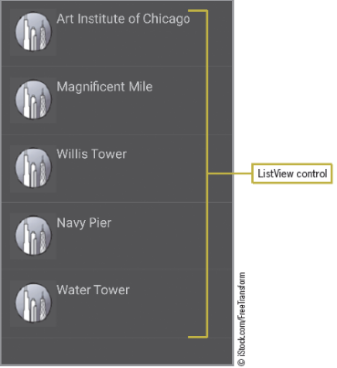
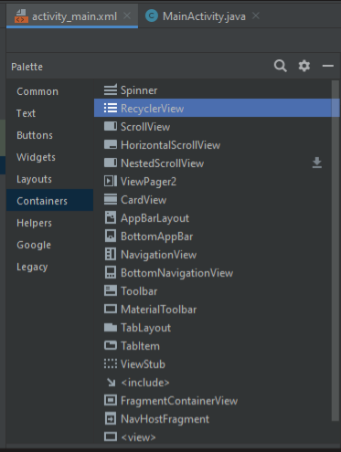

# Android Lists Arrays and Web Browsers

    Course Code: ELEE1146 and COMP1836

    Course Name: Mobile Applications for Engineers/Technologists

    Credits: 15

    Module Leader: Seb Blair BEng(H) PGCAP MIET MIHEEM FHEA

---


## Creating a List

- Lists are one of the most common designs in mobile apps
  - Scrollable
  - Selectable 
  - Programmable to bring up the next Activity (screen)



---

## Extending a ListActivty

- A ListActivity class is needed to display a list of items
- An ListView can be used to provide a list



---

## Creating an Array 
- Array variables can store more than one value
- Different from other data types that can hold only one value
- Each individual item in an array is called an element
- Refer to each element using an index in the array

<div align=center>

|Element| Value|
|---|---|
|attaction[0]| Art Institute of Chicago |
|attaction[1]| Magnificent Mile |
|attaction[2]| Willis Tower |
|attaction[3]| Navy Pier |
|attaction[4]| Water Tower |
</div>

---

## Declaring an Array

- Square brackets `[ ]` are used to define an array
- Curley braces `{ }` contain the list of items in the array

Code Syntax:

```java
String[] attraction={"Art Institute of Chicago","Magnificent Mile","Willis Tower","Navy Pier","Water Tower"};
```

or

```java
String[5] attraction={"Art Institute of Chicago","Magnificent Mile","Willis Tower","Navy Pier","Water Tower"};
```

---

## Using a setListAdapter and Array Adapter

- An **adapter** provides a model for the layout and converts the data into a list
- The `setListAdapter` connects the list items to the images or Web pages they represent
- An `array adapter` supplies the array data to the `ListView`

Code Syntax:

```java
setListAdapter(new ArrayAdapter<String>(this, android.R.Layout.simple_list_item_1, attaction));

```

---

## Primitive & Referecence Data Types 1

- Primitive (Build-in) Data Types
  - examples: `int`, `char`, `float`, `double`, `bool`, etc.

- Reference Data Types (Objects)
  - Every object of a predefined class in Java or user defined class in a user package
  - examples - `arrays`, `widgets`, etc.

---

## Primitive & Reference Data Types 2, Memory Allocation

- Primitive variables - must be allocated to *static* memory 
  - automatically by the compiler
- Objects - must be allocated to *dynamic* memory at runtime
  - programmer’s responsibility - using `new`. 

---

## Primitive & Reference Data Types 3, Creating Variables
- **Primitive variables**
  - declaration - providing a name and a type
  - initialisation - providing initial value
  - Example
        ```java
        int a = 5;
        ```

- **Objects**
  - declaration 
  - allocation - allocating memory (dynamically using new)
  - initialisation  
  - Example
    ```java
    int[ ] a = new int[10];
    ```
---

## Arrays [1]

- Definition
  - Arrays are data structures consisting of data items of the same type packaged together under one name.

- An array has:
  - elements have: 
    - positions (indices)  in the array

<div align=center>

|27|-7|0|16|38|40|16|77|16|
|--|--|--|--|--|--|--|--|--|
|c[0]|c[1]|c[2]|c[3]|c[4]|c[5]|c[6]|c[7]|c[8]|
</div>

`c[]` array elements, `c` array name

---

## Array [2]

- Declaration 
 `arrayType[ ] arrayName;` (`arrayName` is the identifier)
- Allocation - as an object
  - `arrayName = new arrayType[ arraySize ];` (`arraySize` is a  positive number)
- Initialisation
`arrayType[ ] arrayName  = {value1, value2, … , valueN };`
*`value1`, `value2`, … , `valueN` - list of values for array elements of `arrayType`

- Attribute 
`arrayName.length`

---

## Array [3]

Example 1:
```java
int[] c;        // declares the array
c = new int[8]; // allocates the memory
```


Example 2:
```java
// declares the array and allocates memory its elements
double[] b = new double[100];
String[] s = new String[5];
```

---

## Arrays [4]

- Combining declaration and initialisation - no `new` operator explicitly needed - `new` is invoked automatically

```java 
// declares and initialises - no allocation via new!
String daysOfTheWeek[] = {"Monday", "Tuesday", "Wednesday", "Thursday", "Friday", "Saturday", "Sunday"};
```

- `arrayName.length` = the number of the elements in the array 
Example
```java
int length = daysOfTheWeek.length;  // int length = 7
```

---

## Arrays [5] - Initialisation

- In the declaration
  - Example:
```java
int[] a = {0,0,0,0,0,0}; 
int length = a.length; // is equal to 6
```

- one by one
  - Example:
```java
int[] a = new int[6]; 
a[0] = 0; a[1] = 0; a[2] = 0; [3] = 0; a[4] = 0; a[5] = 0; 
```

- Using a for loop
  - Example:
```java
int[] a = new int[6]; 
for (i = 0; i < a.length; i++ ) { a[i] = 0; }
```
---

## Arrays [6] - Examples

```java
{
    {
        int day = 5;
        String dayName;

        String dayOfTheWeek[] = {"Monday", "Tuesday", "Wednesday", 
                        "Thursday","Friday", "Saturday",  "Sunday" };
       
        if ( day > 7 || day < 1) 
        {
            dayName = "That is not a valid day of the week";
        }
        else
        {
             dayName = dayOfTheWeek[day-1]; // Saturday or Friday?
        }
    }
}
```

---

## Android Intent

- Android intents send and receive activities and services including:
  - Opening a Web page in a browser
  - Calling a phone number
  - Locating a GPS position on a map
  - Posting notes to a note-taking program
  - Opening your contacts list
  - Sending a photo
  - Posting to a social network

---
## Launching the Browser from an Android Device

- The intent sends the browser a **URI** (Uniform  Resource Identifier)
**URI** is similar to **URL** (Uniform Resource Locator) 

- URI has additional information necessary for gaining access to the resources required for posting the page

- The action called **ACTION_VIEW** (must be in caps) is what actually displays the page in the browser

---

## Launching the Browser from an Android Device (continued)

Code Syntax

```java
startActivity(new Intent(Intent.ACTION_VIEW, Uri.parse("https://gre.ac.uk")));
```

The `startActivity` code launches the University of Greenwich website when the user selects the first item in the list item.  Mobile friendly sites may display m.gre.ac.uk. Where the letter m denotes a mobile site that was launched automatically due to the platform of a mobile device.

```java
protected void onListItemClick(ListView l, View v, int position, long id){
    switch(position){
        case 0: 
        startActivity(new Intent(Intent.ACTION_VIEW, Uri.parse("https://gre.ac.uk")));
        break;
        case 1: 
        // something else
        break;
        ...
```

---

## Adding Multiple Class Files

- Class Files are needed to display images on the screen when the user selects options


---

## Classes and Acivities

- **Class** - A class is a combination of methods, variables and data types. Every Java or Android project must have at least one class.

```java
public class shape{
    public void circle()
    {
        int A,B,radias;
    }
}
```

- **Activity** - An Activity is an android class. If we want to use an activity class, we must use extend Activity in your android project.

```java
public class shape extends Activity{
    public void circle()
    {
        int A,B,radias;
    }
}
```
---

## Activity 
## Life 
## Cycle

