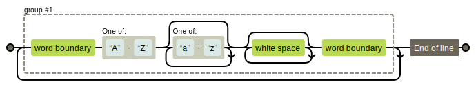

<!-- _footer: ""-->
  
# Sensors

    Course Code: ELEE1146 

    Course Name: Mobile Applications for Engineers

    Credits: 15

    Module Leader: Seb Blair BEng(H) PGCAP MIET MIEEE MIHEEM FHEA

---

## Sensors 101

- A sensor is any device that measures an event or change in an environment and transforms it into an electronic signal that can be read and computed.

- Measuring some phenomena 

- Passive (require and external signal)
- Active (require an external signal)

- Analogue (produce an anlaogue output; ie a continous signal)
- Digital (work with discrete, digital data)

----

## Android `SensorManager`

- The is an abstract class that extends the `Object` class.

- Lets you access the device's **sensors**

- `Sensor` are their own class that also extends `Object`

- `Sensor.getSensorList` gets you all the available sensors.

- `SensorEventListener` used for receiving notifications from the SensorManager when there is new sensor data. 

---

## `Source Code`

The source code is written in `C` and sits on the Linux Kernel that has been modified for the Android OS.

- [https://android.googlesource.com/platform/hardware/libhardware/+/master/include/hardware/sensors.h](https://android.googlesource.com/platform/hardware/libhardware/+/master/include/hardware/sensors.h)

```c 
...
#define SENSOR_STRING_TYPE_ACCELEROMETER                "android.sensor.accelerometer"
#define SENSOR_STRING_TYPE_MAGNETIC_FIELD               "android.sensor.magnetic_field"
#define SENSOR_STRING_TYPE_ORIENTATION                  "android.sensor.orientation"
#define SENSOR_STRING_TYPE_GYROSCOPE                    "android.sensor.gyroscope"
#define SENSOR_STRING_TYPE_LIGHT                        "android.sensor.light"
#define SENSOR_STRING_TYPE_PRESSURE                     "android.sensor.pressure"
#define SENSOR_STRING_TYPE_TEMPERATURE                  "android.sensor.temperature"
...
```


--- 

## Motion Sensors

<div style="font-size:27px">

The sensors' possible architectures vary by sensor type:

- **Software/Hardware**  
  - Gravity, 
  - linear acceleration,
  - rotation vector,
  - significant motion,
  - step counter,
  - step detector sensors

- **Hardware** **Only**
  - accelerometer 
  - gyroscope

</div>

---

## Motion Examples

`TYPE_STEP_COUNTER` is derived from `TYPE_ACCELEROMETER` via software

| Sensor	|Sensor event data|	Description	Units of measure|Type|
|----|----|----|---|
|`TYPE_ACCELEROMETER`	|`SensorEvent.values[0]`|	Acceleration force along the x axis (including gravity).	$m/s2$|Hardware|
||`SensorEvent.values[1]`|	Acceleration force along the y axis (including gravity).||
||`SensorEvent.values[2]`|	Acceleration force along the z axis (including gravity).||
|`TYPE_STEP_COUNTER`	|`SensorEvent.values[0]`|	Number of steps taken by the user since the last reboot while the sensor was activated.Steps|Sofware|

---

## Position sensors

- Two sensors that let you determine the position of a device:
  - Geomagnetic field sensor 
    -  geomagnetic field strength values for each of the three coordinate axes during a single sensor event
  - Accelerometer (we have seen this before)
    - measures the acceleration applied to the device during a sensor event

 


---

## Position Examples
|Sensor|	Sensor event data|	Description|Units|
|---|---|---|--|
|`TYPE_GEOMAGNETIC_ROTATION_VECTOR`|	`SensorEvent.values[0]`|	Rotation vector x axis ($x * sin(\frac{θ}{2})$).|	Unitless|
||`SensorEvent.values[1]`|	Rotation vector y axis ($y * sin(\frac{θ}{2})$)||
||`SensorEvent.values[2]`|	Rotation vector z axis ($z * sin(\frac{θ}{2})$)||
|`TYPE_MAGNETIC_FIELD`|	`SensorEvent.values[0]`|Geomagnetic field strength along the x axis.|	$μT$|
||`SensorEvent.values[1]`|Geomagnetic field strength along the y axis||.
||`SensorEvent.values[2]`|Geomagnetic field strength along the z axis||.

---

## Environment Sensors

- Four sensors that let you monitor various environmental properties:
   - Tempeature
   - Humidity
   - Pressure
   - light
- All hardware based sensors and are available only if a device manufacturer has built them into a device. 
  - Exception is the light sensor which used to control screen brightness

----

## Environment Examples

|Sensor	|Sensor event data|	Units of measure|	Data description|
|--|--|--|--|
|`TYPE_AMBIENT_TEMPERATURE`|`event.values[0]`|	°C|	Ambient air temperature.|
|`TYPE_LIGHT`|`event.values[0]`|	lx|	Illuminance|.
|`TYPE_PRESSURE`|`event.values[0]`|	hPa or mbar|	Ambient air pressure.|
|`TYPE_RELATIVE_HUMIDITY`|`event.values[0]`|	%|	Ambient relative humidity.|
|`TYPE_TEMPERATURE`|`event.values[0]`|°C	|Device temperature|

---

## `Sensor` `Field`'s

- There are numerous variables that provide information about a sensor.
- accessible through functions like...
  ```java
  private int android.hardware.Sensor.mFifoMaxEventCount
  ...
  public int getFifoReservedEventCount (){
  
  return android.hardware.Sensor.mFifoMaxEventCount
  }
  ```
  

  *In the lab will be using Fields to always get the same data from each sensor*
<!--
Number of events reserved for this sensor in the batch mode FIFO. 

This gives a guarantee on the minimum number of events that can be batched. 
-->

---

## `StringBuilder` Class

- a **mutable** sequence of characters. 
- `String` Class in Java creates an **immutable** sequence of characters, 
- Constructs a string builder with no characters in it and an initial capacity of 16 characters

  ```kt
  val stringBuilder = StringBuilder()


  stringBuilder.append("Hello");
  stringBuilder.append("World!");
  // print string
  println("String = " + str.toString());
  ```

  <details>
  <summary>Output?</summary>

  ```
  String = HelloWorld!
  ```

  </details>

<!--
modifying the `String` creates a new String object in the heap memory with the latest content, and the original String is never changed.
-->
---

## `Pattern` Class

- is class used in regular expression(regex)
- is a type of object that is used to help you extract information from any string data by searching through text to find what you need
- you will with high probabilty encounter regex many times in your career and by then this daunting set of characters grouped together will be a breeze:

  ```
  (\b[A-Z][a-z]*\s*\b)+$
  ```

  <details>

  <summary>Means?</summary>

  Search for *Title Case*

  

  </details>

---

## `Pattern` Class

```java
Pattern pattern = Pattern.compile("^(.+)@example.com$");
   
// Input list
List<String> emails = Arrays.asList("anemail@example.com", "whouses@yahoo.com", 
          "sellout@google.com", "youremail@example.com");
  
for(String email : emails)
{
    Matcher matcher = pattern.matcher(email);
      
    if(matcher.matches()) 
    {
      System.out.println(email);
    }
}
```

<details>
<summary>Output?</summary>

```
anemail@example.com
youremail@example.com
```

</details>

<!-- 
^ asserts position at start of a line
. matches any character (except for line terminators)
+ matches the previous token between one and unlimited times, as many times as possible, giving back as needed (greedy)
$ asserts position at the end of a line
--->