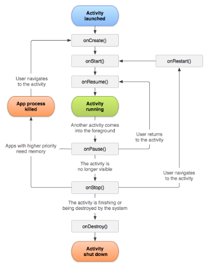

# Sensors 2

    Course Code: ELEE1146 and COMP1836

    Course Name: Mobile Applications for Engineers/Technologists

    Credits: 15

    Module Leader: Seb Blair BEng(H) PGCAP MIET MIEEE MIHEEM FHEA

---

## Activity Lifecycle


To navigate transitions between stages of the activity lifecycle, the `Activity` class provides a core set of six callbacks: 
- `onCreate()`, 
- `onStart()`, 
- `onResume()`, 
- `onPause()`,
- `onStop()`,
- `onDestroy()`.

 The system invokes each of these callbacks as an activity enters a new state.

 ---

## `onCreate()`

- basic application startup logic
  -  that should happen only once for the entire life of the activity. 
  -  bind data to lists, associate the activity with a `ViewModel`, and instantiate some class-scope variables. 
- This method receives the parameter `savedInstanceState`, which is a `Bundle` object containing the activity's **previously** saved state. If the activity has never existed before, the value of the `Bundle` object is `null`.

```java
String gameState;
@Override
public void onCreate(Bundle savedInstanceState) {
    super.onCreate(savedInstanceState);
    if (savedInstanceState != null) {
        gameState = savedInstanceState.getString(GAME_STATE_KEY);
    }
    setContentView(R.layout.main_activity);
    ...
```

---

## `onStart()`

After the `onCreate()` method finishes execution, the activity enters the Started state, and the system calls the `onStart()` and `onResume()` methods in quick succession.

- call makes the activity visible to the user, as the app prepares for the activity to enter the foreground and become interactive, 
- completes very quickly and, as with the `Created` state, the activity does not stay resident in the `Started` state. Once this callback finishes, the activity enters the `Resumed` state, and the system invokes the `onResume()` method.

--- 

## `onResume()`

- comes to the foreground, and then the system invokes the `onResume()` callback. 
- the app stays in this state until something happens to take focus away from the app.
- When an interruptive event occurs, the activity enters the `Paused` state, and the system invokes the `onPause()` callback.
- If the activity returns to the `Resumed` state from the `Paused` state, the system once again calls `onResume()` method. 
> you should implement `onResume()` to initialise components that you release during `onPause()`, and perform any other initialisations that must occur each time the activity enters the `Resumed` state. 

---

## `onPause()`

- system calls this method as the first indication that the user is leaving your activity (though it **does not** always mean the activity is being `destroyed`)
- the activity is no longer in the foreground (though it may still be visible if the user is in multi-window mode)
- Use the `onPause()` method to pause or adjust operations that should not continue (or should continue in moderation) while the Activity is in the `Paused` state, and that you expect to resume shortly.
- use the `onPause()` method to release system resources, handles to sensors (like GPS), or any resources that may affect battery life while your activity is paused and the user does not need them.
> a Paused activity may still be fully visible if in multi-window mode. As such, you should consider using `onStop()` instead of `onPause()` to fully release or adjust UI-related resources and operations to better support multi-window mode

---

## `onStop()`

- your activity is no longer visible to the user, it has entered the Stopped state, and the system invokes the `onStop()` callback.
- the system may also call `onStop()` when the activity has finished running, and is about to be terminated
- should release or adjust resources that are not needed while the app is not visible to the user
  - pause animations
  - switch from fine-grained to coarse-grained location updates
- You should also use `onStop()` to perform relatively CPU-intensive shutdown operations
  - saving to a database

---

## `onDestroy()`

- is called before the activity is destroyed:
  - activity is finishing (due to the user completely dismissing the activity or due to `finish()` being called on the activity), 
  -  system is temporarily destroying the activity due to a configuration change (such as device rotation or multi-window mode)
- `onDestroy()` is the final lifecycle callback the activity receives
> if `onDestroy()` is called as the result of a configuration change, the system immediately creates a new activity instance and then calls `onCreate()` on that new instance in the new configuration.

---
